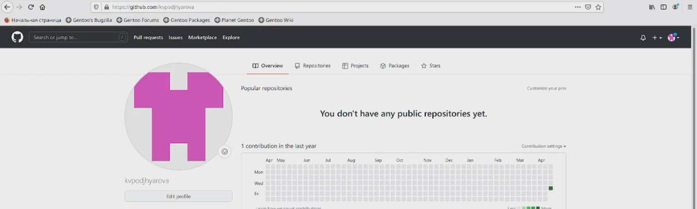
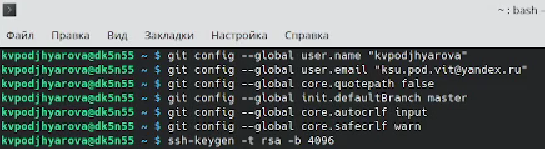
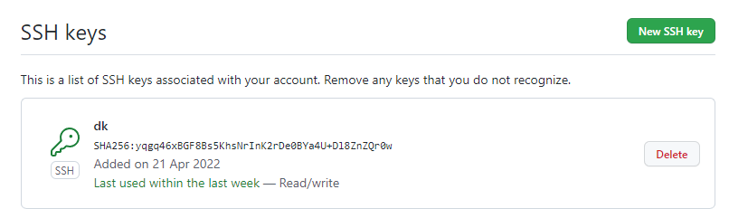
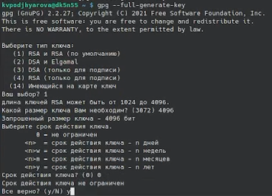
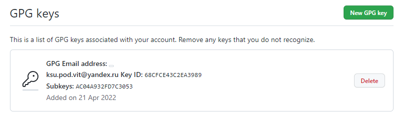
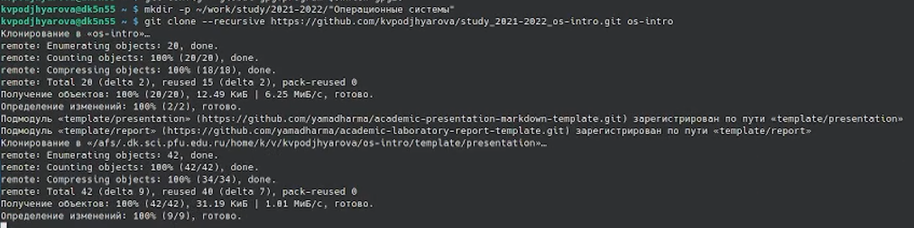
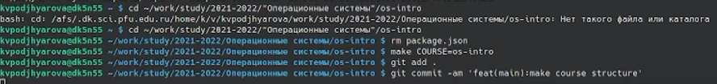
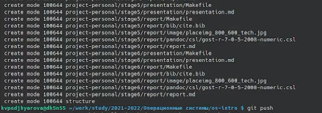

---
## Front matter
lang: ru-RU
title: Презентация по лабораторной работе №3
author: |
	Подъярова Ксения Витальевна (группа: НПМбд-02-21)
institute: |
	Российский Университет Дружбы Народов

## Formatting
toc: false
slide_level: 2
theme: metropolis
header-includes: 
 - \metroset{progressbar=frametitle,sectionpage=progressbar,numbering=fraction}
 - '\makeatletter'
 - '\beamer@ignorenonframefalse'
 - '\makeatother'
aspectratio: 43
section-titles: true
---

# Цель работы

Научиться оформлять презентации с помощью легковесного языка разметки Markdown.

## Задание

Сделать презентацию по предыдущей лабораторной работе в формате Markdown.

# Ход работы

## Создание учётой записи

Создаем учётную запись на https://github.com. Учетная запись называется kvpodjhyarova (Рис. [-@fig:001]). 

{ #fig:001 width=70% }

## Создание ключа ssh

Настраиваем систему контроля версий git. Синхронизируем учётную запись github с компьютером. Затем создаём новый ключ (Рис. [-@fig:002]) и добавляем его в GitHub (Рис.[-@fig:003])

{ #fig:002 width=50% }

{ #fig:003 width=70% }

## Создание ключа gpg

Создаем ключи pgp и добавляем в GitHub. Для этого выводим список ключей, копируем отпечаток приватного ключа в буфер обмена (Рис.[-@fig:004]), переходим в настройки GitHub,нажмимаем на кнопку New GPG key и вставляем полученный ключ в поле ввода (Рис.[-@fig:005])

{ #fig:004 width=30% }

{ #fig:005 width=45% }

## Создание репозитория

Создаем и подключаем  репозиторий к github. (Рис.[-@fig:006])

{ #fig:006 width=80% }

## Настройка каталога курса

Настраиваем каталог курса: переходим в него, удаляем лишние файлы, создаем необходимые каталоги (Рис.[-@fig:007])

{ #fig:007 width=85% }

## Создание коммитов

Добавляем первый коммит и выкладываем на GitHub. Для того, чтобы правильно разместить первый коммит, необходимо добавить команду git add ., после этого с помощью команды git commit -am выкладываем коммит. Сохраняем коммит, используя команду git push. (Рис.[-@fig:008])
(Рис.[-@fig:0081])

{ #fig:008 width=80% }

{ #fig:0081 width=60% }

# Вывод

Я научилась оформлять презентации с помощью легковесного языка разметки Markdown.

