---
## Front matter
lang: ru-RU
title: Презентация по лабораторной работе №4
author: |
	Подъярова Ксения Витальевна (группа: НПМбд-02-21)
institute: |
	Российский Университет Дружбы Народов

## Formatting
toc: false
slide_level: 2
theme: metropolis
header-includes: 
 - \metroset{progressbar=frametitle,sectionpage=progressbar,numbering=fraction}
 - '\makeatletter'
 - '\beamer@ignorenonframefalse'
 - '\makeatother'
aspectratio: 43
section-titles: true
---

# Цель работы

Приобретение практических навыков взаимодействия пользователя с системой посредством командной строки.

# Ход работы

## Полное имя домашнего каталога

Определяем полное имя домашнего каталога с помощью команды pwd (рис. [-@fig:001])

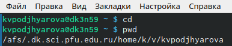{ #fig:001 width=70% }

## "Вывод на экран содержимого каталога /tmp"

Переходим в каталог /tmp. Выводим на экран содержимое каталога/tmp. Для этого используем команду ls с различными опциями.

"ls" - выводится список каталогов и файлов, которые можно увидеть, "вручную" открыв каталог tmp (рис. [-@fig:021])

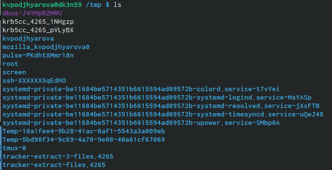{ #fig:021 width=70% }

## "Команда "ls -а"

"ls -a"  - к списку, описанному в предыдущем пункте, добавляются скрытые каталоги и файлы (рис. [-@fig:022])

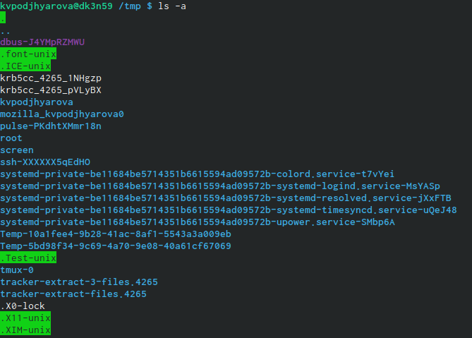{ #fig:022 width=70% }

## Команда "ls -F"

"ls -F" - с помощью этой команды получаем информацию о типах файлов (рис. [-@fig:023])

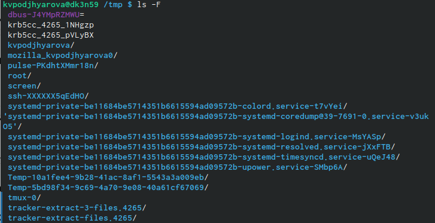{ #fig:023 width=70% }

## "Команда "ls -l"

"ls -l" - получаем список каталогов и файлов, но уже с более подробной информацией о них (рис. [-@fig:024])

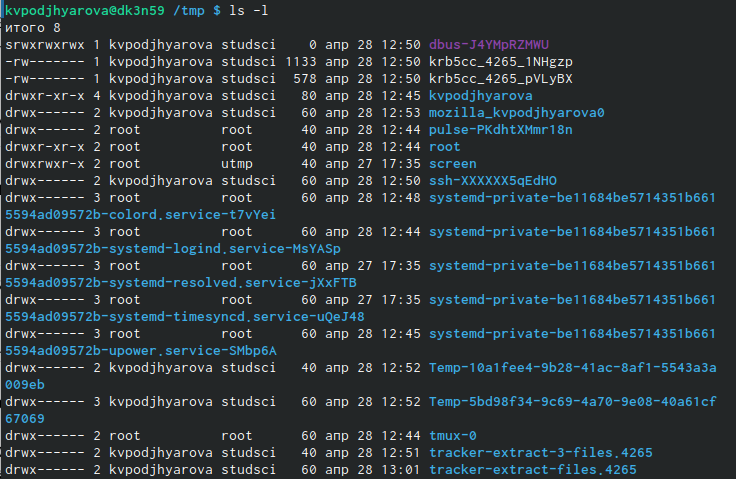{ #fig:024 width=70% }

## "Команда "ls -alF"

"ls -alF" - данная команда отображает список всех каталогов и файлов, в том числе и скрытых, с подробной информацией о них (рис. [-@fig:025])

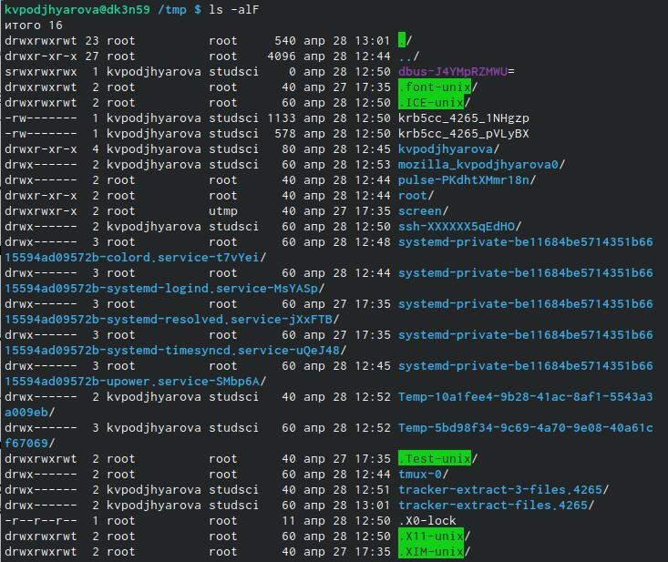{ #fig:025 width=57% }

## Определяем ,есть ли в каталоге /var/spool подкаталог с именем cron

Определяем ,есть ли в каталоге /var/spool подкаталог с именем cron (рис. [-@fig:026])

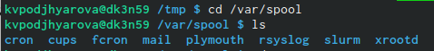{ #fig:026 width=70% }

## Вывод на экран содержимого домашнего каталога

Переходим в домашний каталог и выводим на экран его содержимое (рис. [-@fig:027])

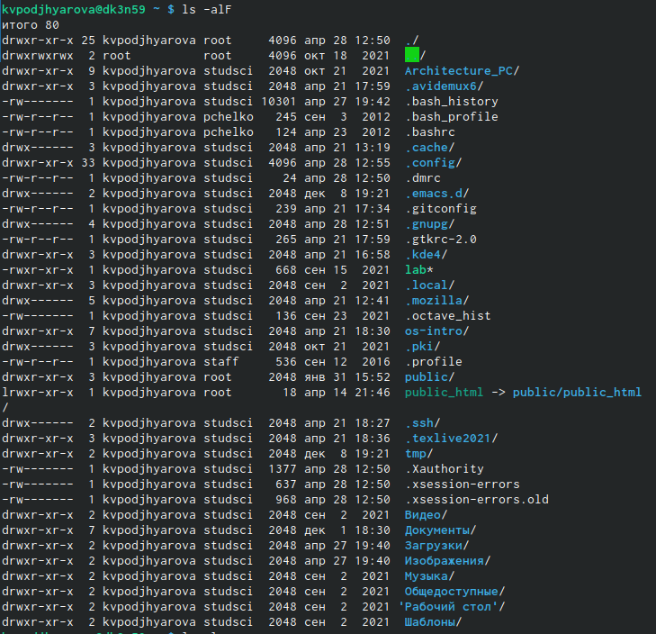{ #fig:027 width=55% }

## Создание каталога ~/newdir/morefun

В домашнем каталоге создаем новый каталог с именем newdir. В каталоге ~/newdir создаем новый каталог с именем morefun (рис. [-@fig:031])

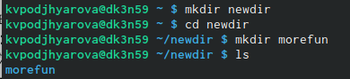{ #fig:031 width=70% }

## Создание и удаление трех новых каталогов с именами letters, memos, misk

В домашнем каталоге создаем одной командой три новых каталога с именами letters, memos, misk. Затем удаляем эти каталоги одной командой.(рис. [-@fig:032])

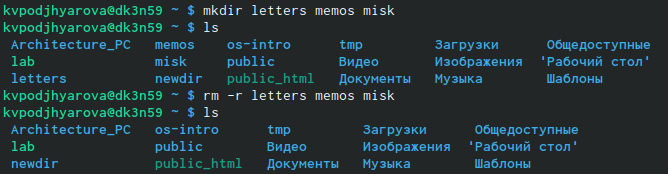{ #fig:032 width=70% }

## Попытка удалить каталог ~/newdir

Попробуем удалить ранее созданный каталог ~/newdir командой rm. Он не удалён.(рис. [-@fig:033])

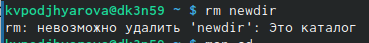{ #fig:033 width=70% }

## Удаление каталога ~/newdir

Удаляем каталог ~/newdir/morefun из домашнего каталога. Проверяем, был ли каталог удалён. (рис. [-@fig:034])

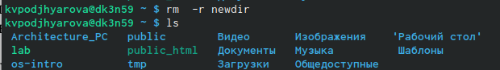{ #fig:034 width=70% }

## Определение опции команды ls

С помощью команды man определяем, какую опцию команды ls нужно использовать для просмотра содержимого не только указанного каталога, но и подкаталогов, входящих в него.(рис. [-@fig:004])

{ #fig:004 width=70% }

## Определение опции команды ls

С помощью команды man определите опцию команды ls, позволяющую отсортировать по времени последнего изменения выводимый список содержимого каталога с развёрнутым описанием файлов.(рис. [-@fig:005])

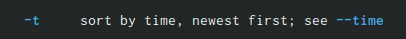{ #fig:005 width=70% }

## Описание команд

Используем команду man для просмотра описания следующих команд:cd,pwd,mkdir,rmdir,rm.

## Описание команды сd (рис. [-@fig:061])

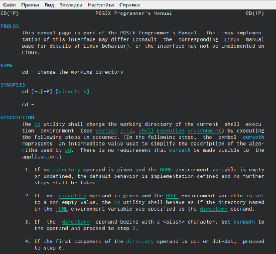{ #fig:061 width=65% }

## Описание команды pwd (рис. [-@fig:062])

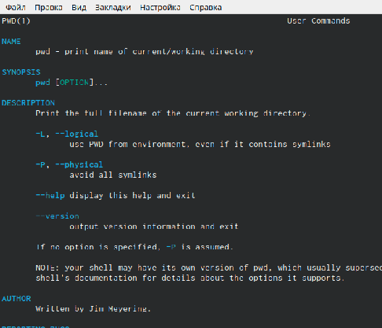{ #fig:062 width=70% }

## Описание команды mkdir (рис. [-@fig:063])

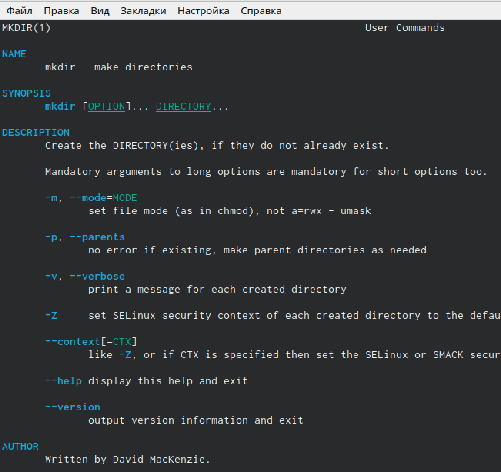{ #fig:063 width=65% }

## Описание команды rmdir (рис. [-@fig:064])

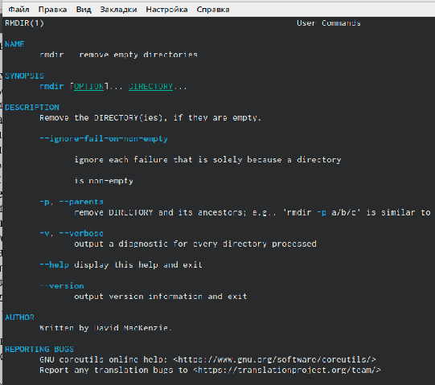{ #fig:064 width=70% }

## Описание команды rm (рис. [-@fig:065])

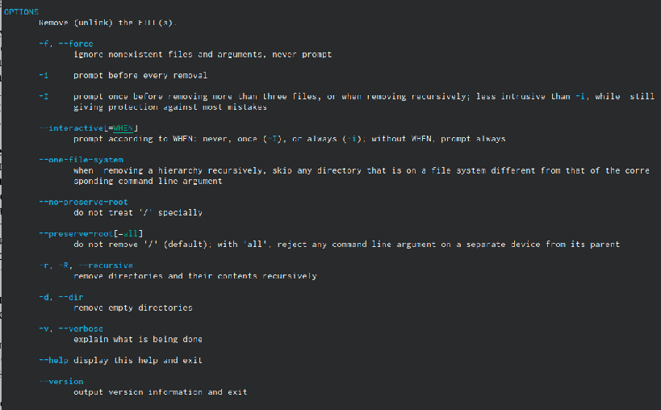{ #fig:065 width=70% }

## Вывод истории команд

Выведем историю команд с помощью команды "history"(рис. [-@fig:007])

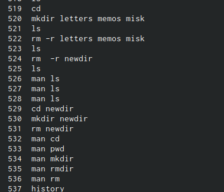{ #fig:007 width=65% }

# Выводы

Я приобрела практические навыки взаимодействия пользователя с системой посредством командной строки.

