---
## Front matter
lang: ru-RU
title: Презентация по лабораторной работе №5
author: |
	Подъярова Ксения Витальевна (группа: НПМбд-02-21)
institute: |
	Российские Университет Дружбы Народов

## Formatting
toc: false
slide_level: 2
theme: metropolis
header-includes: 
 - \metroset{progressbar=frametitle,sectionpage=progressbar,numbering=fraction}
 - '\makeatletter'
 - '\beamer@ignorenonframefalse'
 - '\makeatother'
aspectratio: 43
section-titles: true
---

# Цель работы

Ознакомление с файловой системой Linux, её структурой, именами и содержаниемкаталогов. Приобретение практических навыков по применению команд для работыс файлами и каталогами, по управлению процессами (и работами),по проверке использования диска и обслуживанию файловой системы.

# Ход работы

## Выполнение примеров, приведённых в первой части описания лабораторной работы. 

1) Выполняю примеры из пункта 5.2.2. (рис. [-@fig:001]) (рис. [-@fig:002])

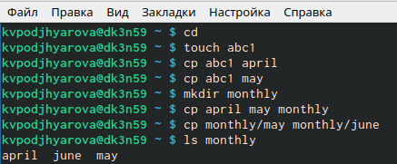{ #fig:001 width=55% }

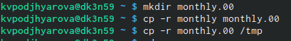{ #fig:002 width=55% }

## Выполнение примеров из пункта 5.2.3 (рис. [-@fig:003]) 

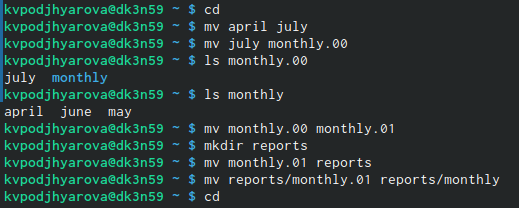{ #fig:003 width=70% }

## Выполнение примеров из пункта 5.2.5 (рис. [-@fig:004]) 

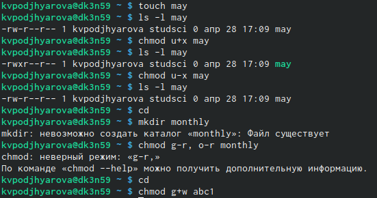{ #fig:004 width=70% }

## Выполняю следующие действия.

1) Копирую файл/usr/include/sys/io.h в домашний каталог и называю его equipment.(рис. [-@fig:005]) 

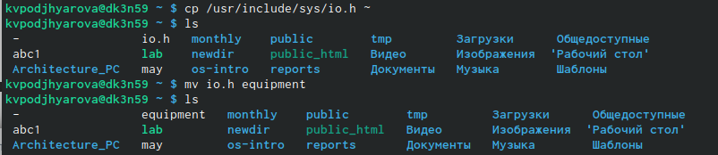{ #fig:005 width=70% }

## Файл equiplist

В домашнем каталоге создаю директорию ~/ski.plases. Перемещаю файл equipment в каталог ~/ski.plases. Переименовываю файл ~/ski.plases/equipment в ~/ski.plases/equiplist.(рис. [-@fig:006]) 

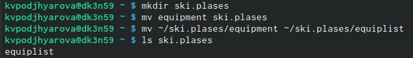{ #fig:006 width=70% }

## Файл equiplist2 

Создаю в домашнем каталоге файл abc1 и копирую его в каталог ~/ski.plases, называю его equiplist2.(рис. [-@fig:007]) 

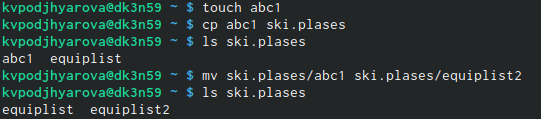{ #fig:007 width=70% }

## Перемещение файлов ~/ski.plases/equiplist иe quiplist2 в каталог ~/ski.plases/equipment

Создаю каталог с именем equipment в каталоге ~/ski.plases.Перемещаю файлы ~/ski.plases/equiplist иe quiplist2 в каталог ~/ski.plases/equipment.(рис. [-@fig:008]) 

{ #fig:008 width=70% }

## Каталог ~/newdir

Создаю и перемещаю каталог ~/newdir в каталог ~/ski.plases и называю его plans.(рис. [-@fig:009]) 

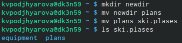{ #fig:009 width=70% }

## Опции команды chmod

Создаю необходимые файлы. Определяю опции команды chmod, необходимые для того, чтобы присвоить перечисленным ниже файлам выделенные права доступа, считая, что в начале таких прав нет:
drwxr--r--   ...   australia
drwx--x--x   ...   play
-r-xr--r--   ...   my_os
-rw-rw-r--   ...   feathers
(рис. [-@fig:010]) 

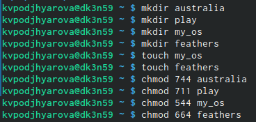{ #fig:010 width=50% }

## Cодержимое файла /etc/password

Просматриваю содержимое файла /etc/password (рис. [-@fig:011]) 

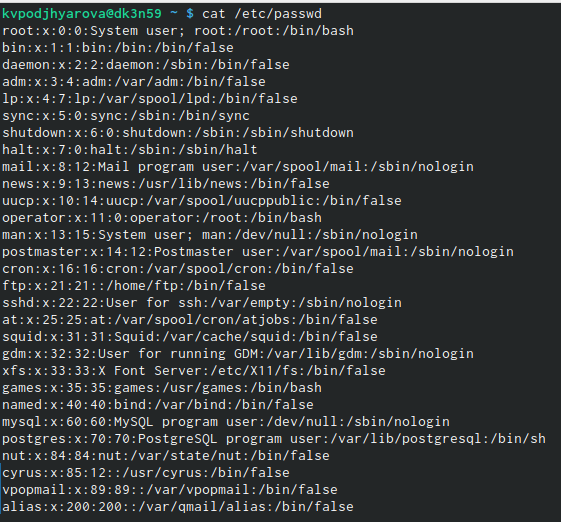{ #fig:011 width=57% }

## Каталог games

Копирую файл ~/feathers в файл ~/file.old. Перемещаю файл ~/file.old в каталог ~/play. Копирую каталог ~/play в каталог ~/fun. Перемещаю каталог ~/fun в каталог ~/play и называю его games.(рис. [-@fig:012]) 

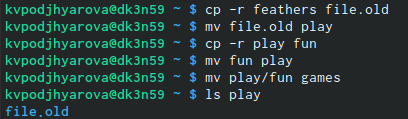{ #fig:012 width=70% }

## Изменение прав доступа файла feathers

Лишаю владельца файла ~/feathers права на чтение.Пытаюсь просмотреть файл ~/feathersкомандойcat, нам отказано в доступе. Пытаюсь скопировать файл ~/feathers. Даю владельцу файла ~/feathers право на чтение.(рис. [-@fig:013]) 

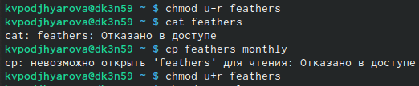{ #fig:013 width=70% }

## Изменение прав доступа каталога play

Лишаю владельца каталога ~/play права на выполнение.Перехожу в каталог ~/play.Даю владельцу каталога ~/playправо на выполнение.(рис. [-@fig:014]) 

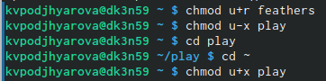{ #fig:014 width=70% }

## Чтение man по командам mount,fsck,mkfs,kill.

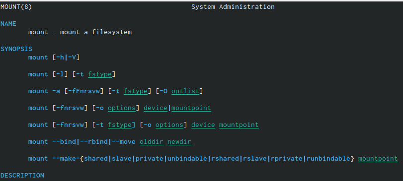{ #fig:015 width=70% }

## Чтение man по команде fsck

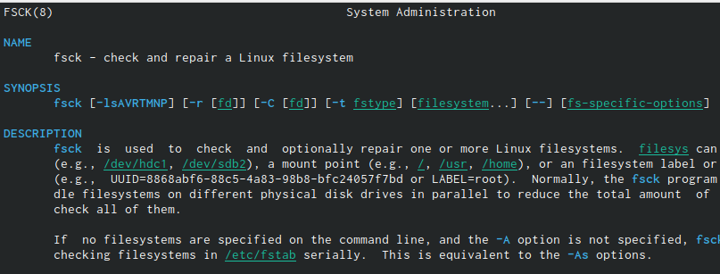{ #fig:016 width=70% }

## Чтение man по команде mkfs

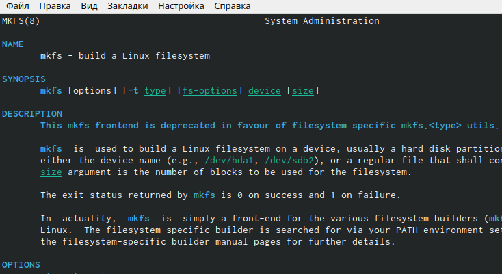{ #fig:017 width=70% }

## Чтение man по командt kill

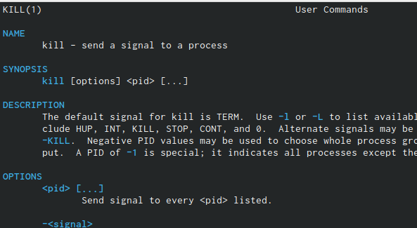{ #fig:018 width=70% }

# Выводы

Я ознакомилась с файловой системой Linux, её структурой, именами и содержанием каталогов. Приобрела практические навыки по применению команд для работы с файлами и каталогами,по управлению процессами (и работами), по проверке использования диска и обслуживанию файловой системы.

