---
## Front matter
title: "Отчет по лабораторной работе №5"
subtitle: "дисциплина: Операционные системы"
author: "Подъярова Ксения Витальевна"

## Generic otions
lang: ru-RU
toc-title: "Содержание"

## Bibliography
bibliography: bib/cite.bib
csl: pandoc/csl/gost-r-7-0-5-2008-numeric.csl

## Pdf output format
toc: true # Table of contents
toc-depth: 2
lof: true # List of figures
lot: true # List of tables
fontsize: 12pt
linestretch: 1.5
papersize: a4
documentclass: scrreprt
## I18n polyglossia
polyglossia-lang:
  name: russian
  options:
	- spelling=modern
	- babelshorthands=true
polyglossia-otherlangs:
  name: english
## I18n babel
babel-lang: russian
babel-otherlangs: english
## Fonts
mainfont: PT Serif
romanfont: PT Serif
sansfont: PT Sans
monofont: PT Mono
mainfontoptions: Ligatures=TeX
romanfontoptions: Ligatures=TeX
sansfontoptions: Ligatures=TeX,Scale=MatchLowercase
monofontoptions: Scale=MatchLowercase,Scale=0.9
## Biblatex
biblatex: true
biblio-style: "gost-numeric"
biblatexoptions:
  - parentracker=true
  - backend=biber
  - hyperref=auto
  - language=auto
  - autolang=other*
  - citestyle=gost-numeric
## Pandoc-crossref LaTeX customization
figureTitle: "Рис."
tableTitle: "Таблица"
listingTitle: "Листинг"
lofTitle: "Список иллюстраций"
lotTitle: "Список таблиц"
lolTitle: "Листинги"
## Misc options
indent: true
header-includes:
  - \usepackage{indentfirst}
  - \usepackage{float} # keep figures where there are in the text
  - \floatplacement{figure}{H} # keep figures where there are in the text
---

# Цель работы

Ознакомление с файловой системой Linux, её структурой, именами и содержаниемкаталогов. Приобретение практических навыков по применению команд для работыс файлами и каталогами, по управлению процессами (и работами),по проверке использования диска и обслуживанию файловой системы.

# Выполнение лабораторной работы

1. Выполняю все примеры, приведённые в первой части описания лабораторной работы. 

1) Выполняю примеры из пункта 5.2.2. (рис. [-@fig:001]) (рис. [-@fig:002])

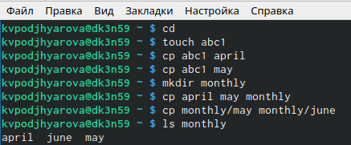{ #fig:001 width=70% }

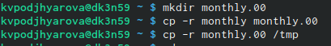{ #fig:002 width=70% }

2) Выполняю примеры из пункта 5.2.3 (рис. [-@fig:003]) 

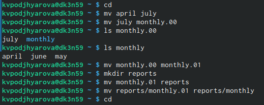{ #fig:003 width=70% }

3) Выполняю примеры из пункта 5.2.5 (рис. [-@fig:004]) 

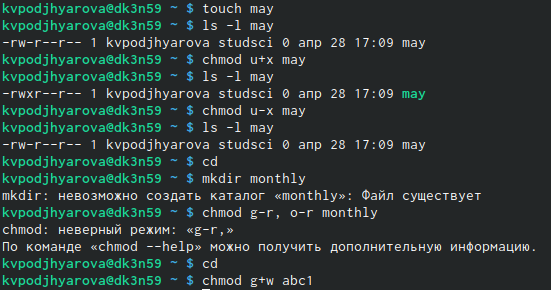{ #fig:004 width=70% }

2. Выполняю следующие действия.

1) Копирую файл/usr/include/sys/io.h в домашний каталог и называю его equipment.(рис. [-@fig:005]) 

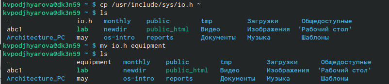{ #fig:005 width=70% }

2) В домашнем каталоге создаю директорию ~/ski.plases. Перемещаю файл equipment в каталог ~/ski.plases. Переименовываю файл ~/ski.plases/equipment в ~/ski.plases/equiplist.(рис. [-@fig:006]) 

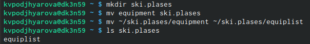{ #fig:006 width=70% }

3) Создаю в домашнем каталоге файл abc1 и копирую его в каталог ~/ski.plases, называю его equiplist2.(рис. [-@fig:007]) 

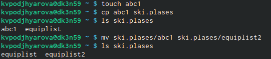{ #fig:007 width=70% }

4) Создаю каталог с именем equipment в каталоге ~/ski.plases.Перемещаю файлы ~/ski.plases/equiplist иe quiplist2 в каталог ~/ski.plases/equipment.(рис. [-@fig:008]) 

{ #fig:008 width=70% }

5) Создаю и перемещаю каталог ~/newdir в каталог ~/ski.plases и называю его plans.(рис. [-@fig:009]) 

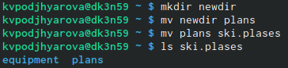{ #fig:009 width=70% }

3. Создаю необходимые файлы. Определяю опции команды chmod, необходимые для того, чтобы присвоить перечисленным ниже файлам выделенные права доступа, считая, что в начале таких правнет:

drwxr--r--   ...   australia

drwx--x--x   ...   play

-r-xr--r--   ...   my_os

-rw-rw-r--   ...   feathers

(рис. [-@fig:010]) 

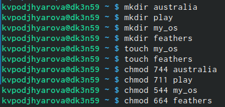{ #fig:010 width=70% }

4. Проделываю приведённые ниже упражнения 

1) Просматриваю содержимое файла /etc/password (рис. [-@fig:011]) 

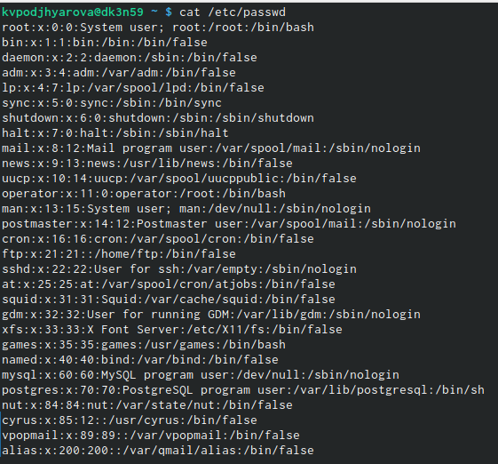{ #fig:011 width=70% }

2) Копирую файл ~/feathers в файл ~/file.old. Перемещаю файл ~/file.old в каталог ~/play. Копирую каталог ~/play в каталог ~/fun. Перемещаю каталог ~/fun в каталог ~/play и называю его games.(рис. [-@fig:012]) 

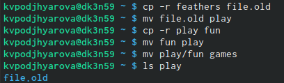{ #fig:012 width=70% }

3) Лишаю владельца файла ~/feathers права на чтение.Пытаюсь просмотреть файл ~/feathersкомандойcat, нам отказано в доступе. Пытаюсь скопировать файл ~/feathers. Даю владельцу файла ~/feathers право на чтение.(рис. [-@fig:013]) 

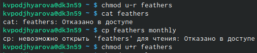{ #fig:013 width=70% }

4) Лишаю владельца каталога ~/play права на выполнение.Перехожу в каталог ~/play.Даю владельцу каталога ~/playправо на выполнение.(рис. [-@fig:014]) 

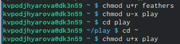{ #fig:014 width=70% }

5) Читаю man по командам mount,fsck,mkfs,kill.

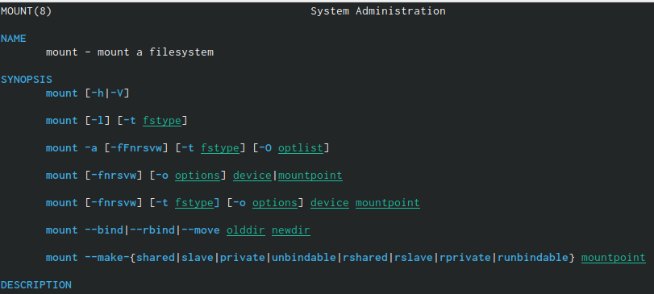{ #fig:015 width=70% }

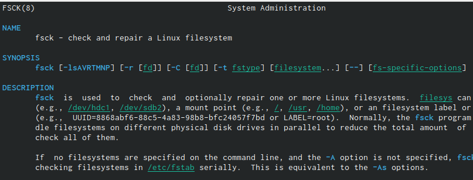{ #fig:016 width=70% }

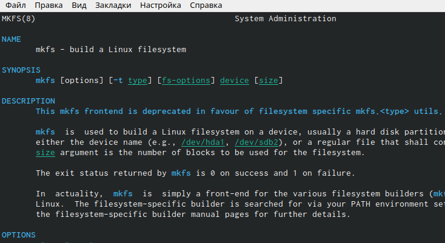{ #fig:017 width=70% }

{ #fig:018 width=70% }

# Выводы

Я ознакомилась с файловой системой Linux, её структурой, именами и содержанием каталогов. Приобрела практические навыки по применению команд для работы с файлами и каталогами,по управлению процессами (и работами), по проверке использования диска и обслуживанию файловой системы.

