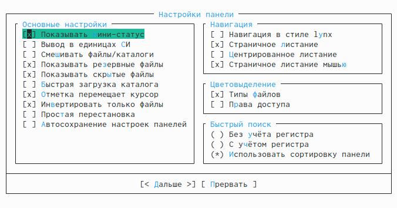

---
## Front matter
lang: ru-RU
title: Презентация по лабораторной работе №7
author: |
	Подъярова Ксения Витальевна (группа: НПМбд-02-21)
institute: |
	Российский Университет Дружбы Народов

## Formatting
toc: false
slide_level: 2
theme: metropolis
header-includes: 
 - \metroset{progressbar=frametitle,sectionpage=progressbar,numbering=fraction}
 - '\makeatletter'
 - '\beamer@ignorenonframefalse'
 - '\makeatother'
aspectratio: 43
section-titles: true
---

# Цель работы
Освоение основных возможностей командной оболочки Midnight Commander. Приобретение навыков практической работы по просмотру каталогов и файлов; манипуляций с ними.

# Выполнение лабораторной работы

# Задание по mc

## Информация о mc

Изучила информацию о mc, вызвав в командной строке man mc. Узнала, что MC - это псевдографическая командная оболочка для систем.(рис. [-@fig:001])

{ #fig:001 width=70% }

## Структура и меню mc

Запустила из командной строки mc, изучила его структуру и меню. В стандартном состоянии окно редактора состоит из двух панелей. Верхнее меню содержит меню "Левая панель" (рис. [-@fig:002]), "Файл" (рис. [-@fig:003]), "Команда" (рис. [-@fig:004]), "Настройки" (рис. [-@fig:005]), "Правая панель" (рис. [-@fig:006]).

{ #fig:002 width=70% }

## Файл

{ #fig:003 width=70% }

## Команда

{ #fig:004 width=70% }

## Настройки

{ #fig:005 width=70% }

## Правая панель

{ #fig:006 width=70% }

## Выполнение операций в mc

Выполнила несколько операций в mc, используя управляющие клавиши.

Выделение файлов (клавиша insert) (рис. [-@fig:007])

{ #fig:007 width=70% }

## Выделение/отмена выделения файлов

Для выделения файлов или его отмены можно использовать команды "Снять отметку", "Обратить выделение" в меню "Файл" (рис. [-@fig:008])

{ #fig:008 width=43% }

## Копирование и перемещение файлов

Для копирования файлов используется клавиша F5 (рис. [-@fig:009]), клавиша F6 используется для перемещения (рис. [-@fig:010])
  
{ #fig:009 width=53% }

{ #fig:010 width=53% }

## Информация

Для получения информации можно перейти в "Левая панель" -> "Информация" (рис. [-@fig:011])
  
{ #fig:011 width=70% }

## Формат списка

"Левая панель" -> "Формат списка" -> "Расширенный" (рис. [-@fig:012]) (рис. [-@fig:013])
  
{ #fig:012 width=47% }
  
{ #fig:013 width=38% }

## Права доступа

"Файл" -> "Права доступа" (рис. [-@fig:014])
  
{ #fig:014 width=67% }

## Расширенные права

"Файл" -> "Права"(расширенные). Помимо названия файла или каталога выводит сведения о правах
доступа, владельце, группе, размере, времени правки (рис. [-@fig:015])
  
{ #fig:015 width=70% }

## Выполняю основные команды меню правой панели.

  1) "Список файлов" отображает размер файла и время его правки (рис. [-@fig:016])
  
{ #fig:016 width=45% }

## Быстрый просмотр

2) "Быстрый просмотр" нужен для предпросмотра содержания файла.(рис. [-@fig:017])
  
{ #fig:017 width=70% }
  
## Информация

3) "Информация" отображает подробные данные о файле (рис. [-@fig:018])
  
{ #fig:018 width=60% }
  
## Дерево

4) "Дерево" необходим для просмотра дерева каталога (рис. [-@fig:019])
  
{ #fig:019 width=35% }

## Выбор кодировки

5) "Выбор кодировки" нужен для просмотра и смены кодировки (рис. [-@fig:020])
  
{ #fig:020 width=70% }

## Используя возможности подменю "Файл", выполняю:

  1) просмотр и редактирование содержимого текстового файла (рис. [-@fig:021])
  
{ #fig:021 width=60% }

## Создание каталога

2) создание каталога (рис. [-@fig:022])
  
{ #fig:022 width=70% }

## Копирование

3) копирование в файлов в созданный каталог(рис. [-@fig:023])
  
{ #fig:023 width=70% }

## С помощью соответствующих средств подменю "Команда" осуществила:

  1) Поиск в файловой системе файла с заданными условиями (например, файла
с расширением .cрр) (рис. [-@fig:024])
  
{ #fig:024 width=47% }

  2) Выбор и повторение одной из предыдущих команд. Перешла в пункт "История" командной строки и увидела, что появилась строка История, но она пустая, потому что командная строка не была использована.
  
## Переход в домашний каталог

3) Перешла в домашний каталог с помощью Дерева каталогов (рис. [-@fig:025])
  
{ #fig:025 width=70% }
  
## Операции, определяющие структуру экрана mc

Вызвала подменю "Настройки". Освоила операции, определяющие структуру экрана mc.

  1) Конфигурация — позволяет скорректировать настройки работы с панелями.(рис. [-@fig:026])
  
{ #fig:026 width=70% }
  
## Внешний вид и настройка панелей

2) Внешний вид (рис. [-@fig:027]) и Настройки панелей (рис. [-@fig:028]) — определяет элементы (строка меню, командная строка, подсказки и прочее), отображаемые при вызове mc, а также геометрию расположения панелей и цветовыделение.
  
{ #fig:027 width=47% }

## Настройка панелей

{ #fig:028 width=70% }

## Биты символов

3) Биты символов — задаёт формат обработки информации локальным терминалом.(рис. [-@fig:031])
  
{ #fig:031 width=70% }

## Подтверждение

4) Подтверждение — позволяет установить или убрать вывод окна с запросом подтверждения действий при операциях удаления и перезаписи файлов, а также при выходе из программы (рис. [-@fig:029])
  
{ #fig:029 width=70% }

## Оформление

5) Оформление - позволяет менять цветовую гамму визуальной оболочки (рис. [-@fig:030])
  
{ #fig:030 width=70% }

# Задание по встроенному редактору mc

## Создание текстового файла text.txt

1. Создаю текстовой файл text.txt. (рис. [-@fig:032])
  
{ #fig:032 width=70% }

## Вставила фрагмент текста из Интернета

2. Открыла этот файл с помощью встроенного в mc редактора.

3. Вставила в открытый файл небольшой фрагмент текста, скопированный из Интернета.(рис. [-@fig:033])
  
{ #fig:033 width=80% }

## Проделываю с текстом следующие манипуляции, используя горячие клавиши:

  1) Удалила строку текста с помощью клавиши F8.
  
  2) Выделила фрагмент текста (F3) и скопировала его на новую строку (F6).
  
  3) Сохранила файл с помощью клавиши F2.
  
  4) Отменила последнее действие с помощью комбинации ctrl+u.
  
  5) Перешла в конец файла (ctrl+end) и написала строку "Лабораторна работа №7". Перешла в начало файла (ctrl+home) и написала строку "4 мая 2022 год" (рис. [-@fig:035])
  
{ #fig:035 width=50% }
  
  7) Сохранила файл (F2) и вышла из него.
  
## Выключение подсветки синтаксиса

Используя меню редактора, выключила подсветку синтаксиса.(рис. [-@fig:034])
  
{ #fig:034 width=58% }

# Выводы

Я освоила основные возможности командной оболочки Midnight Commander. Приобрела навыки практической работы по просмотру каталогов и файлов; манипуляций с ними.

