---
## Front matter
title: "Отчёт по лабораторной работе №7"
subtitle: "Дисциплина: Операционные системы"
author: "Подъярова Ксения Витальевна"

## Generic otions
lang: ru-RU
toc-title: "Содержание"

## Bibliography
bibliography: bib/cite.bib
csl: pandoc/csl/gost-r-7-0-5-2008-numeric.csl

## Pdf output format
toc: true # Table of contents
toc-depth: 2
lof: true # List of figures
lot: true # List of tables
fontsize: 12pt
linestretch: 1.5
papersize: a4
documentclass: scrreprt
## I18n polyglossia
polyglossia-lang:
  name: russian
  options:
	- spelling=modern
	- babelshorthands=true
polyglossia-otherlangs:
  name: english
## I18n babel
babel-lang: russian
babel-otherlangs: english
## Fonts
mainfont: PT Serif
romanfont: PT Serif
sansfont: PT Sans
monofont: PT Mono
mainfontoptions: Ligatures=TeX
romanfontoptions: Ligatures=TeX
sansfontoptions: Ligatures=TeX,Scale=MatchLowercase
monofontoptions: Scale=MatchLowercase,Scale=0.9
## Biblatex
biblatex: true
biblio-style: "gost-numeric"
biblatexoptions:
  - parentracker=true
  - backend=biber
  - hyperref=auto
  - language=auto
  - autolang=other*
  - citestyle=gost-numeric
## Pandoc-crossref LaTeX customization
figureTitle: "Рис."
tableTitle: "Таблица"
listingTitle: "Листинг"
lofTitle: "Список иллюстраций"
lotTitle: "Список таблиц"
lolTitle: "Листинги"
## Misc options
indent: true
header-includes:
  - \usepackage{indentfirst}
  - \usepackage{float} # keep figures where there are in the text
  - \floatplacement{figure}{H} # keep figures where there are in the text
---

# Цель работы
Освоение основных возможностей командной оболочки Midnight Commander. Приобретение навыков практической работы по просмотру каталогов и файлов; манипуляций с ними.

# Выполнение лабораторной работы

### Задание по mc

1. Изучила информацию о mc, вызвав в командной строке man mc. Узнала, что MC - это псевдографическая командная оболочка для систем.(рис. [-@fig:001])

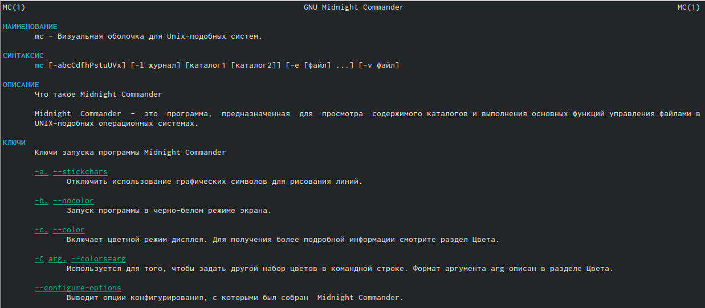{ #fig:001 width=70% }

2. Запустила из командной строки mc, изучила его структуру и меню. В стандартном состоянии окно редактора состоит из двух панелей. Верхнее меню содержит меню "Левая панель" (рис. [-@fig:002]), "Файл" (рис. [-@fig:003]), "Команда" (рис. [-@fig:004]), "Настройки" (рис. [-@fig:005]), "Правая панель" (рис. [-@fig:006]).

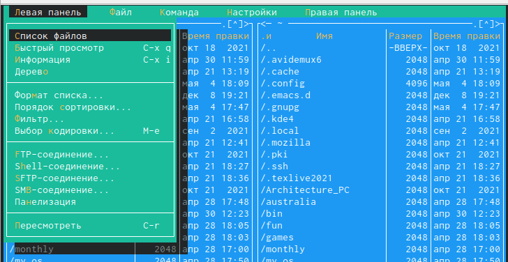{ #fig:002 width=70% }

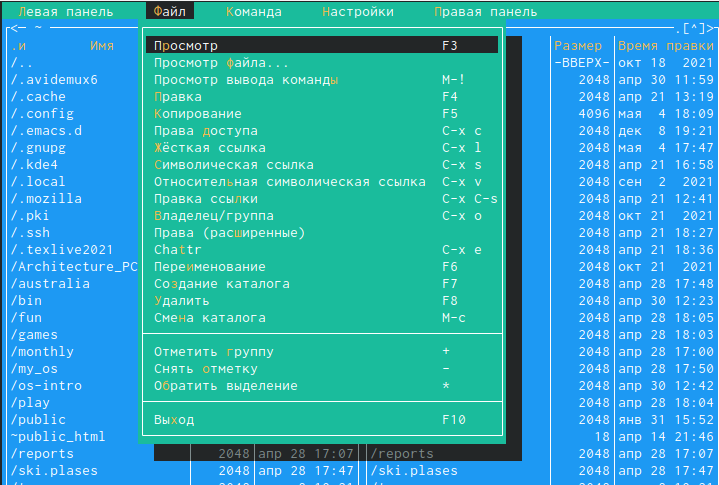{ #fig:003 width=70% }

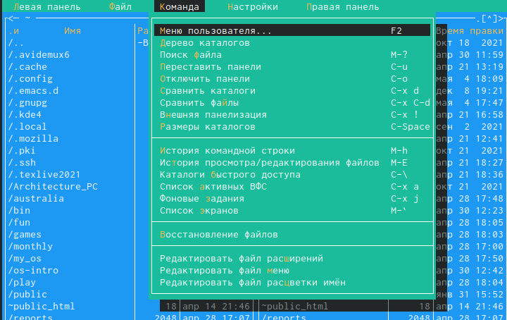{ #fig:004 width=70% }

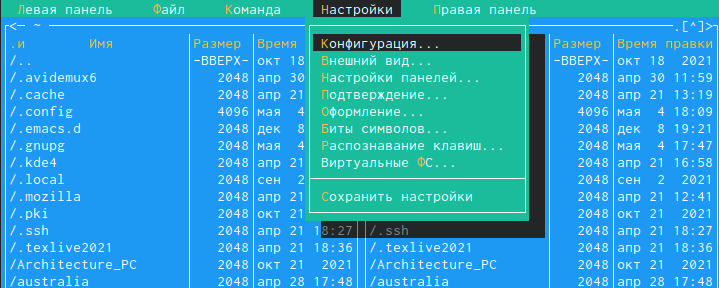{ #fig:005 width=70% }

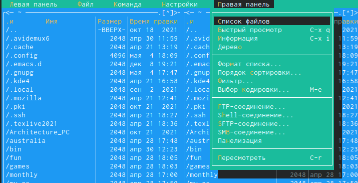{ #fig:006 width=70% }

3. Выполнила несколько операций в mc, используя управляющие клавиши.

  1) Выделение файлов (клавиша insert) (рис. [-@fig:007])

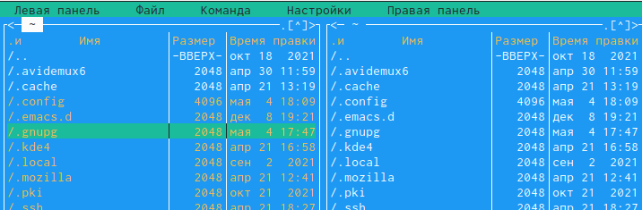{ #fig:007 width=70% }

  2) Для выделения файлов или его отмены можно использовать команды "Снять отметку", "Обратить выделение" в меню "Файл" (рис. [-@fig:008])

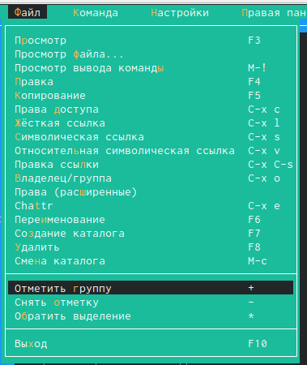{ #fig:008 width=70% }

  3) Для копирования файлов используется клавиша F5 (рис. [-@fig:009]), клавиша F6 используется для перемещения (рис. [-@fig:010])
  
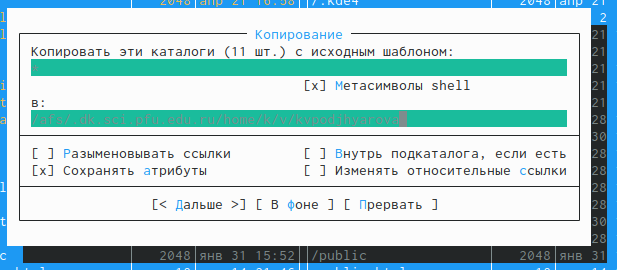{ #fig:009 width=70% }

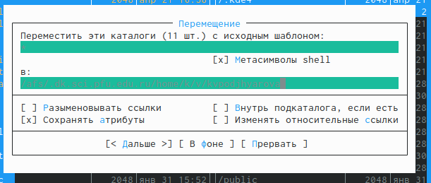{ #fig:010 width=70% }

  4) Для получения информации можно перейти в "Левая панель" -> "Информация" (рис. [-@fig:011])
  
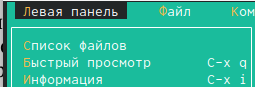{ #fig:011 width=70% }

  5) "Левая панель" -> "Формат списка" -> "Расширенный" (рис. [-@fig:012]) (рис. [-@fig:013])
  
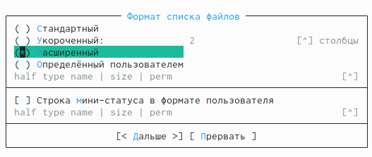{ #fig:012 width=70% }
  
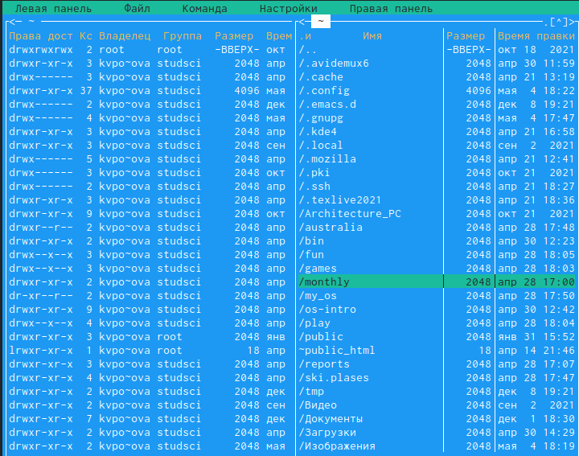{ #fig:013 width=70% }

  6) "Файл" -> "Права доступа" (рис. [-@fig:014])
  
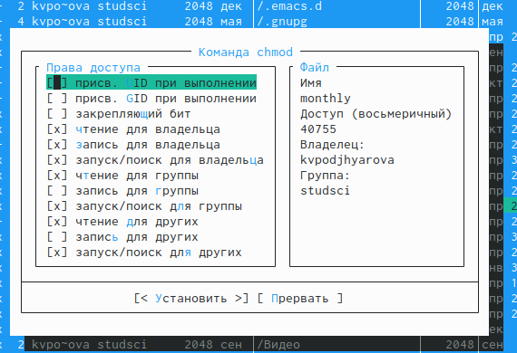{ #fig:014 width=70% }

  7) "Файл" -> "Права"(расширенные). Помимо названия файла или каталога выводит сведения о правах
доступа, владельце, группе, размере, времени правки (рис. [-@fig:015])
  
{ #fig:015 width=70% }

4. Выполняю основные команды меню правой панели.

  1) "Список файлов" отображает размер файла и время его правки (рис. [-@fig:016])
  
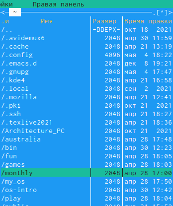{ #fig:016 width=70% }

  2) "Быстрый просмотр" нужен для предпросмотра содержания файла.(рис. [-@fig:017])
  
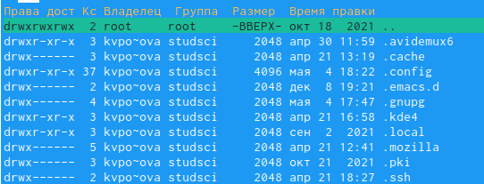{ #fig:017 width=70% }
  
  3) "Информация" отображает подробные данные о файле (рис. [-@fig:018])
  
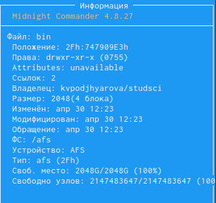{ #fig:018 width=70% }
  
  4) "Дерево" необходим для просмотра дерева каталога (рис. [-@fig:019])
  
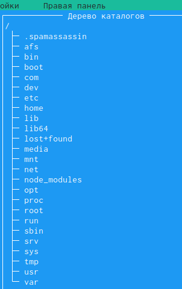{ #fig:019 width=70% }

  5) "Выбор кодировки" нужен для просмотра и смены кодировки (рис. [-@fig:020])
  
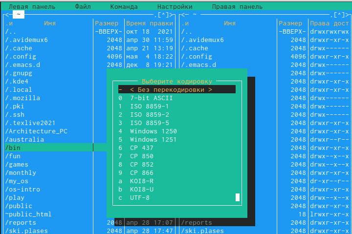{ #fig:020 width=70% }

5. Используя возможности подменю "Файл", выполняю:

  1) просмотр и редактирование содержимого текстового файла (рис. [-@fig:021])
  
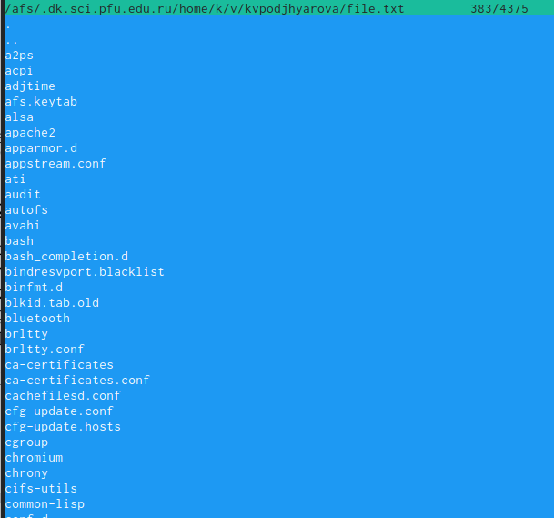{ #fig:021 width=70% }

  2) создание каталога (рис. [-@fig:022])
  
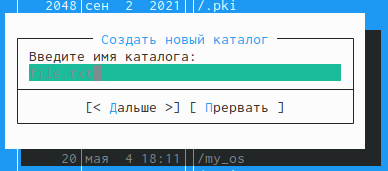{ #fig:022 width=70% }

 3) копирование в файлов в созданный каталог(рис. [-@fig:023])
  
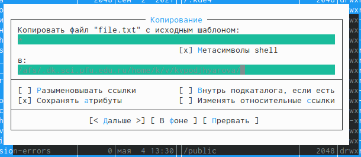{ #fig:023 width=70% }

6. С помощью соответствующих средств подменю "Команда" осуществила:

  1) Поиск в файловой системе файла с заданными условиями (например, файла
с расширением .cрр) (рис. [-@fig:024])
  
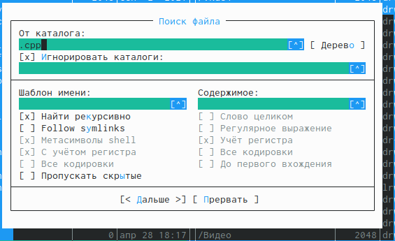{ #fig:024 width=70% }

  2) Выбор и повторение одной из предыдущих команд. Перешла в пункт "История" командной строки и увидела, что появилась строка История, но она пустая, потому что командная строка не была использована.
  
  3) Перешла в домашний каталог с помощью Дерева каталогов (рис. [-@fig:025])
  
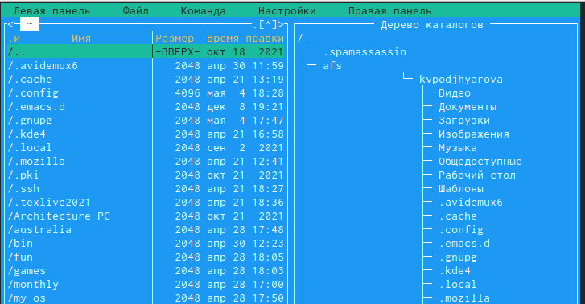{ #fig:025 width=70% }
  
7. Вызвала подменю "Настройки". Освоила операции, определяющие структуру экрана mc.

  1) Конфигурация — позволяет скорректировать настройки работы с панелями.(рис. [-@fig:026])
  
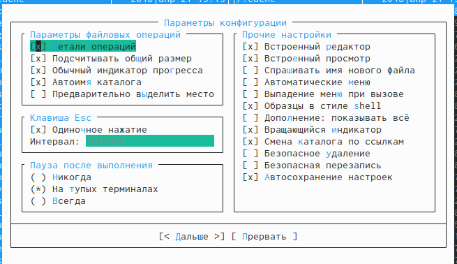{ #fig:026 width=70% }
  
  2) Внешний вид (рис. [-@fig:027]) и Настройки панелей (рис. [-@fig:028]) — определяет элементы (строка меню, командная строка, подсказки и прочее), отображаемые при вызове mc, а также геометрию расположения панелей и цветовыделение.
  
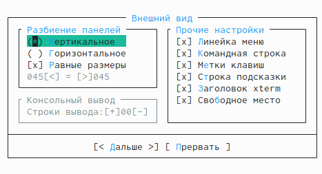{ #fig:027 width=70% }

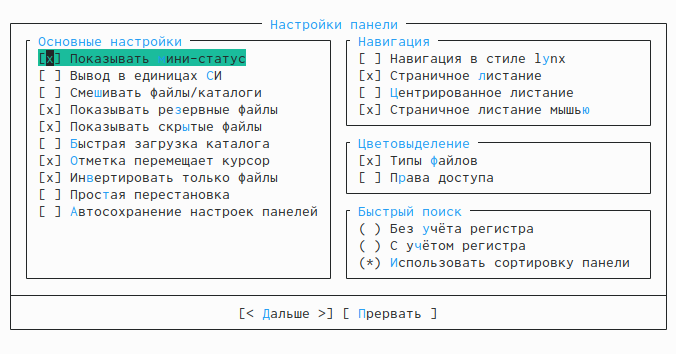{ #fig:028 width=70% }

  3) Биты символов — задаёт формат обработки информации локальным терминалом.(рис. [-@fig:031])
  
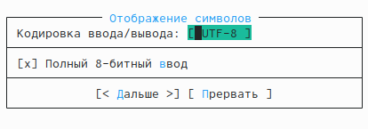{ #fig:031 width=70% }

  4) Подтверждение — позволяет установить или убрать вывод окна с запросом подтверждения действий при операциях удаления и перезаписи файлов, а также при выходе из программы (рис. [-@fig:029])
  
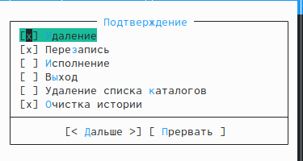{ #fig:029 width=70% }

  5) Оформление - позволяет менять цветовую гамму визуальной оболочки (рис. [-@fig:030])
  
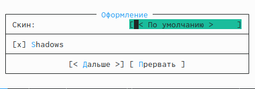{ #fig:030 width=70% }

### Задание по встроенному редактору mc

1. Создаю текстовой файл text.txt. (рис. [-@fig:032])
  
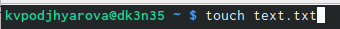{ #fig:032 width=70% }

2. Открыла этот файл с помощью встроенного в mc редактора.

3. Вставила в открытый файл небольшой фрагмент текста, скопированный из Интернета.(рис. [-@fig:033])
  
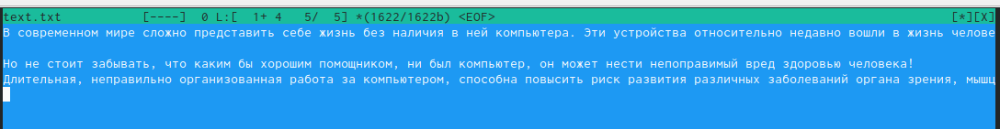{ #fig:033 width=70% }

4. Проделайте с текстом следующие манипуляции, используя горячие клавиши:

  1) Удалила строку текста с помощью клавиши F8.
  
  2) Выделила фрагмент текста (F3) и скопировала его на новую строку (F6).
  
  3) Сохранила файл с помощью клавиши F2.
  
  4) Отменила последнее действие с помощью комбинации ctrl+u.
  
  5) Перешла в конец файла (ctrl+end) и написала строку "Лабораторна работа №7". Перешла в начало файла (ctrl+home) и написала строку "4 мая 2022 год" (рис. [-@fig:035])
  
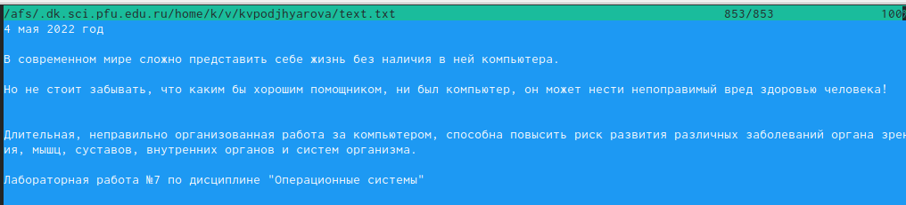{ #fig:035 width=60% }
  
  7) Сохранила файл (F2) и вышла из него.
  
6. Используя меню редактора, выключила подсветку синтаксиса.(рис. [-@fig:034])
  
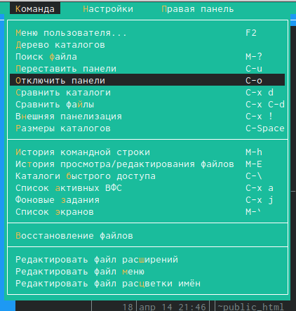{ #fig:034 width=70% }

# Ответы на контрольные вопросы:

1. Панели могут дополнительно быть переведены в один из двух режимов: «Информация» или «Дерево». В режиме «Информация» на панель выводятся сведения о файле и текущей файловой системе, расположенных на активной панели. В режиме «Дерево» на одной из панелей выводится структура дерева каталогов.

2. Как с помощью команд shell, так и с помощью меню (комбинаций клавиш) mc можно выполнить следующие операции с файлами:

• копирование «F5» («cp имя_файла имя_каталога (в который копируем)») 

• перемещение/переименование «F6» («mv имя_файла имя_каталога (в который перемещаем)») 

• создание каталога «F7» («mkdir имя_каталога») 

• удаление «F8» («rm имя_файла») • изменение прав доступа «ctrl+x» («chmod u+x имя_файла») 

3. Перейти в строку меню панелей mc можно с помощью функциональной клавиши «F9». В строке меню имеются пять меню: «Левая панель», «Файл», «Команда», «Настройки» и «Правая панель». Под пункт меню «Быстрый просмотр» позволяет выполнить быстрый просмотр содержимого панели. Подпункт меню «Информация» позволяет посмотреть информацию о файле или каталоге. В меню каждой (левой или правой) панели можно выбрать «Формат списка»: 

• стандартный − выводит список файлов и каталогов с указанием размера и времени правки; 

• ускоренный − позволяет задать число столбцов, на которые разбивается панель при выводе списка имён файлов или каталогов без дополнительной информации; 

• расширенный − помимо названия файла или каталога выводит сведения о правах доступа, владельце, группе, размере, времени правки; 

• определённый пользователем − позволяет вывести те сведения о файле или каталоге, которые задаст сам пользователь. Подпункт меню «Порядок сортировки» позволяет задать критерии сортировки при выводе списка файлов и каталогов: без сортировки, по имени, расширенный, время правки, время доступа, время изменения атрибута, размер, узел. 

4. Команды меню «Файл»: 

• Просмотр(«F3»)− позволяет посмотреть содержимое текущего (или выделенного) файла без возможности редактирования. 

• Просмотр вывода команды («М»+«!»)− функция запроса команды с параметрами (аргумент к текущему выбранному файлу). 

• Правка(«F4») − открывает текущий (или выделенный) файл для его редактирования. 

• Копирование(«F5»)− осуществляет копирование одного или нескольких файлов или каталогов в указанное пользователем во всплывающем окне место. 

• Права доступа («Ctrl-x»«c»)− позволяет указать (изменить) права доступа к одному или нескольким файлам или каталогам. 

• Жёсткая ссылка («Ctrl-x»«l»)− позволяет создать жёсткую ссылку к текущему(или выделенному) файлу. 

• Символическая ссылка («Ctrl-x»«s»)− позволяет создать символическую ссылку к текущему (или выделенному) файлу. 

• Владелец/группа («Ctrl-x»«o»)− позволяет задать (изменить) владельца и имя группы для одного или нескольких файлов или каталогов. 

• Права(расширенные)− позволяет изменить права доступа и владения для одного или нескольких файлов или каталогов.

• Переименование («F6»)− позволяет переименовать (или переместить) один или несколько файлов или каталогов. 

• Создание каталога («F7») − позволяет создать каталог. 

• Удалить («F8») − позволяет удалить один или несколько файлов или каталогов. • Выход («F10») − завершает работу mc. 

5. Меню Команда В меню Команда содержатся более общие команды для работы с mc. Команды меню Команда: 

• Дерево каталогов − отображает структуру каталогов системы. 

• Поиск файла − выполняет поиск файлов по заданным параметрам. 

• Переставить панели − меняет местами левую и правую панели. 

• Сравнить каталоги («Ctrl-x»«d») − сравнивает содержимое двух каталогов. 

• Размеры каталогов − отображает размер и время изменения каталога (по умолчанию в mc размер каталога корректно не отображается). 

• История командной строки − выводит на экран список ранее выполненных в оболочке команд. 

• Каталоги быстрого доступа(Ctrl-»)− при вызове выполняется быстрая смена текущего каталога на один из заданного списка. 

• Восстановление файлов − позволяет восстановить файлы на файловых системах ext2 и ext3. 

• Редактировать файл расширений − позволяет задать с Елизавета Пермякова, вчера в 20:21 помощью определённого синтаксиса действия при запуске файлов с определённым расширением (например, какое программное обеспечение запускать для открытия или редактирования файлов с расширением doc или docx). 

• Редактировать файл меню − позволяет отредактировать контекстное меню пользователя, вызываемое по клавише «F2». 

• Редактировать файл расцветки имён − позволяет подобрать оптимальную для пользователя расцветку имён файлов в зависимости от их типа. 

6. Меню Настройки содержит ряд дополнительных опций по внешнему виду и функциональности mc. Меню Настройки содержит: 

• Конфигурация − позволяет скорректировать настройки работы с панелями. 

• Внешний вид и Настройки панелей − определяет элементы (строка меню, командная строка, подсказки и прочее), отображаемые при вызове mc, а также геометрию расположения панелей и цветовыделение. 

• Биты символов − задаёт формат обработки информации локальным терминалом. 

• Подтверждение − позволяет установить или убрать вывод окна с запросом подтверждения действий при операциях удаления и перезаписи файлов, а также при выходе из программы. 

• Распознание клавиш − диалоговое окно используется для тестирования функциональных клавиш, клавиш управления курсором и прочее. 

• Виртуальные ФС − настройки виртуальной файловой системы: тайм-аут, пароль и прочее. 

7. Функциональные клавиши mc: 

• F1 – вызов контекстно-зависимой подсказки 

• F2 – вызов пользовательского меню с возможностью создания и/или дополнения дополнительных функций 

• F3 – просмотр содержимого файла, на который указывает подсветка в активной панели (без возможности редактирования) 

• F4 – вызов встроенного в mc редактора для изменения содержания файла, на который указывает подсветка в активной панели 

• F5 – копирование одного или нескольких файлов, отмеченных впервой (активной) панели, в каталог, отображаемый на второй панели 

• F6 – перенос одного или нескольких файлов, отмеченных в первой (активной) панели, в каталог, отображаемый на второй панели 

• F7 – создание подкаталога в каталоге, отображаемом в активной панели 

• F8 – удаление одного или нескольких файлов (каталогов), отмеченных в первой (активной) панели файлов 

• F9 – вызов меню mc 

• F10 – выход из mc 

8. Встроенный в mc редактор вызывается с помощью функциональной клавиши «F4». В нём удобно использовать различные комбинации клавиш при редактировании содержимого (как правило текстового) файла. Клавиши для редактирования файла: 

• «Ctrl-y» − удалить строку 

• «Ctrl-u» − отмена последней операции 

• «ins» - вставка/замена 

• «F7» − поиск (можно использовать регулярные выражения) 

• «F7» − повтор последней операции поиска 

• «F4» − замена 

• «F3» − первое нажатие − начало выделения, второе − окончание выделения 

• «F5» − копировать выделенный фрагмент 

• «F6» − переместить выделенный фрагмент 

• «F8» − удалить выделенный фрагмент 

• «F2» − записать изменения в файл 

• «F10» − выйти из редактор 

9. Для редактирования меню пользователя, которое вызывается клавишей «F2», необходимо перейти в пункт «Редактировать файл меню» → «Команда» и изменить настройки файла. 

10. Часть команд «Меню пользователя», а также меню «Файл» позволяют выполнять действия, определяемые пользователем, над текущим файлом. Например, копирование каталога или файла, переименование, перемещение, архивирование.

# Выводы

Я освоила основные возможности командной оболочки Midnight Commander. Приобрела навыки практической работы по просмотру каталогов и файлов; манипуляций с ними.

