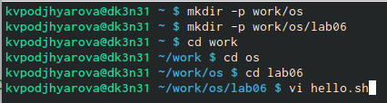
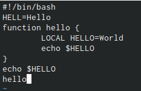
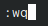
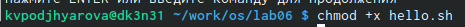
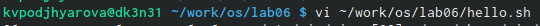
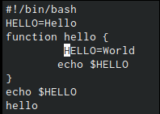
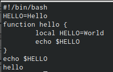
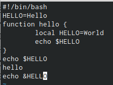
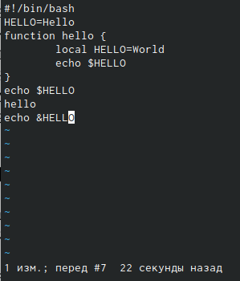

---
## Front matter
lang: ru-RU
title: Презентация по лабораторной работе №8
author: |
	Подъярова Ксения Витальевна (группа: НПМбд-02-21)
institute: |
	Российский Университет Дружбы Народов

## Formatting
toc: false
slide_level: 2
theme: metropolis
header-includes: 
 - \metroset{progressbar=frametitle,sectionpage=progressbar,numbering=fraction}
 - '\makeatletter'
 - '\beamer@ignorenonframefalse'
 - '\makeatother'
aspectratio: 43
section-titles: true
---

# Цель работы

Познакомиться с операционной системой Linux. Получить практические навыки работы с редактором vi, установленным по умолчанию практически во всех дистрибутивах.

# Выполнение лабораторной работы

# Задание 1. Создание нового файла с использованием vi

## Создание каталога

Создаю каталог с именем ~/work/os/lab06. Перехожу во вновь созданный каталог. Вызываю vi и создаю файл hello.sh (рис. [-@fig:001])

{ #fig:001 width=70% }

## Вводим текст

Нажимаем клавишу i и вводим следующий текст.(рис. [-@fig:002])

{ #fig:002 width=70% }

## Сохранение и завершение работы

Нажимаем клавишу Esc для перехода в командный режим после завершения ввода текста. 

Нажимаем : для перехода в режим последней строки и внизу экрана появилось приглашение в виде двоеточия.

Нажимаем w (записать) и q (выйти), а затем нажимаем клавишу Enter для сохранения текста и завершения работы.(рис. [-@fig:003])

{ #fig:003 width=20% }

## Делаем файл исполняемым

Делаем файл исполняемым (рис. [-@fig:004])

{ #fig:004 width=70% }

# Задание 2. Редактирование существующего файла

## Вызов vi

Вызов vi на редактирование файла (рис. [-@fig:005])

{ #fig:005 width=70% }

## Замена слова HELL и удаление слова LOCAL

Установливаю курсор в конец слова HELL второй строки с помощью горячих клавиш.

Перехожу в режим вставки с помощью клавиши i и заменяю на HELLO. Нажимаю Esc для возврата в командный режим.(рис. [-@fig:006])

Установливаю курсор на четвертую строку и стираю слово LOCAL. (рис. [-@fig:006])

{ #fig:006 width=35% }

## Режим "Вставка"

Перехожу в режим вставки и набираю следующий текст: local, нажимаю Esc для возврата в командный режим. (рис. [-@fig:007])

{ #fig:007 width=70% }

## Вставка строки "echo $HELLO"

Устанавливаю курсор на последней строке файла с помощью клавиши G. Вставляю после неё строку, содержащую следующий текст: echo $HELLO и нажмаю Esc для перехода в командный режим. (рис. [-@fig:008])

{ #fig:008 width=60% }

## Удаление последней строки

Удаляю последнюю строку.(рис. [-@fig:009])

{ #fig:009 width=70% }

## Отмена изменений

Ввожу команду отмены изменений с помощью клавиши u для отмены последней команды.(рис. [-@fig:010])

{ #fig:010 width=40% }

## Завершение работы

Ввожу символ : для перехода в режим последней строки. Записываю произведённые изменения (с помощью клавиши w) и выхожу из vi (с помощью клавиши q).(рис. [-@fig:011])

{ #fig:011 width=20% }

# Выводы

Я познакомилась с операционной системой Linux. Получила практические навыки работы с редактором vi, установленным по умолчанию практически во всех дистрибутивах.

