---
## Front matter
lang: ru-RU
title: Презентация по лабораторной работе №10
author: |
	Подъярова Ксения Витальевна
institute: |
	Росийский Университет Дружбы Народов

## Formatting
toc: false
slide_level: 2
theme: metropolis
header-includes: 
 - \metroset{progressbar=frametitle,sectionpage=progressbar,numbering=fraction}
 - '\makeatletter'
 - '\beamer@ignorenonframefalse'
 - '\makeatother'
aspectratio: 43
section-titles: true
---

# Цель работы

Изучить основы программирования в оболочке ОС UNIX/Linux. Научиться писать небольшие командные файлы.

# Выполнение лабораторной работы

## Задание №1

1. 1) Для начала я изучила команды архивации, используя команды man bzip2, man zip, man tar.(рис. [-@fig:001]) 

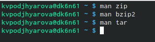{ #fig:001 width=50% }

## ZIP

Синтаксис команды zip для архивации файла: zip [опции] [имя файла.zip] [файлы иил папки, которые будем архивировать]. Cинтаксис команды zip для разархивации файла: unzip [опции] [файл архива.zip] [файлы] -x [исключить] -d [папка] (рис. [-@fig:002]) 

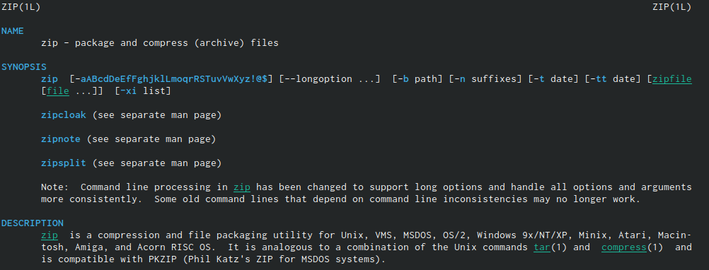{ #fig:002 width=62% }

## bzip2

Синтакисис bzip2 для архивации файла: bzip2 [опции][имена файлов]. Cинтаксис команды bzip2 для разархивации файла: bunzip2[опции][архивы.bz2] (рис. [-@fig:003])

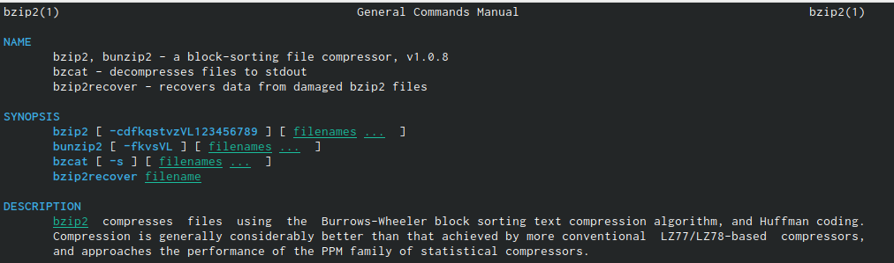{ #fig:003 width=62% }

## tar

Cинтаксис команды tar для архивации: tar [опции][архив.tar][файлы для архивации]. Cинтаксис команды для разархивации: tar [опции] [архив.tar] (рис. [-@fig:004])

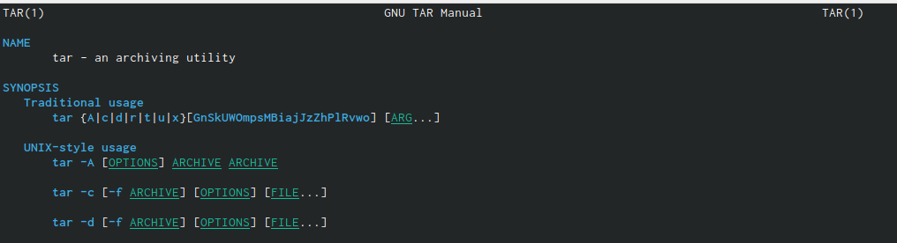{ #fig:004 width=65% }

## Скрипт 1

2) Создала файл, в котором в будущем буду писать первый скрипт, и открыла его в редакторе emacs, используя клавиши Ctrl-x Ctrl-f 

3) Написала скрипт, который при запуске будет делать резервную копию самого себя (то есть файла, в котором содержится его исходный код) в другую директорию backup в моем домашнем каталоге. При этом файл должен архивироваться одним из архиваторов на выбор ( я выбрала при написании bzip2 (рис. [-@fig:006])

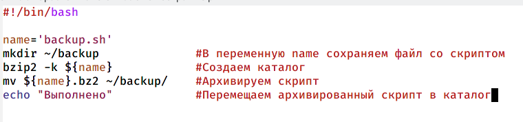{ #fig:006 width=49% }

## Проверка работы скрипта

4) Проверила работу скрипта (команда ./backup.sh), предварительно добавив для него права на выполнение (chmod +x *.sh). Проверила, появился ли каталог backup/, перейдя в него (команда cd backup/), посмотрела его содержимое (ls) и просмотрела содержимое архива (bunzip2 -backup.sh.bz2). Скрипт работает корректно (рис. [-@fig:007])

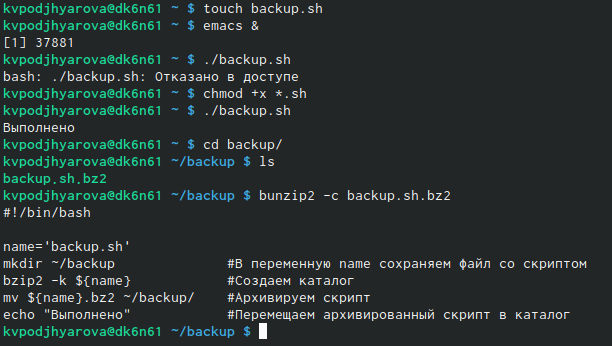{ #fig:007 width=54% }

## Задание №2

2. 1) Создала файл, в котором буду писать второй скрипт, и открыла его в редакторе emacs, используя клавиши Ctrl-x Ctrl-f (рис. [-@fig:009])

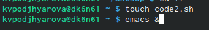{ #fig:009 width=50% }

## Скрипт 2

2) Написала пример командного файла, обрабатывающего любое произвольное число аргументов командной строки, в том числе превышающее 10. Например, скрипт может последовательно распечатать значения всех переданных аргументов (рис. [-@fig:010])

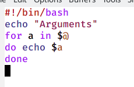{ #fig:010 width=50% }

## Проверка работы скрипта

3) Проверила работу написанного скрипта, предварительно добавив для него право на выполнение. Вводила аргументы количество которых меньше 10(рис. [-@fig:011]) и больше 10(рис. [-@fig:012]). Скрипт работае корректно

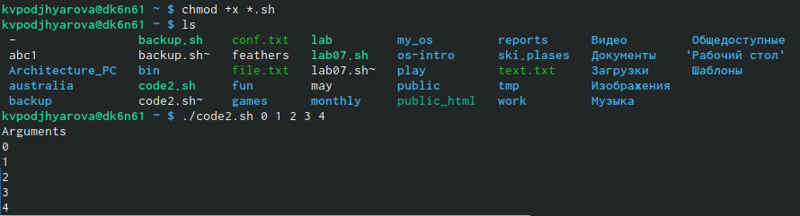{ #fig:011 width=52% }

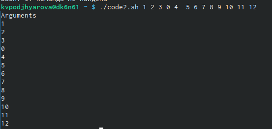{ #fig:012 width=30% }

## Задание №3

3. 1) Создала файл, в котором буду писать третий скрипт, и открыла его в редакторе emacs (рис. [-@fig:013])

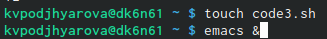{ #fig:013 width=55% }

## Скрипт 3

2) Написалаа командный файл - аналог команды ls без использования этой самой команды и команды dir). Он должен выдавать информацию о нужном каталоге и выводить информацию о возможностях доступа к файлам этого каталога (рис. [-@fig:014])

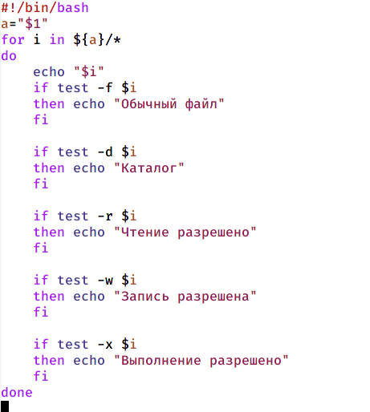{ #fig:014 width=35% }

## Проверка работы скрипта

3) Далее проверила работу скрипта, предварительно добавив для него право на выполнение. Скрипт работает корректно (рис. [-@fig:015])

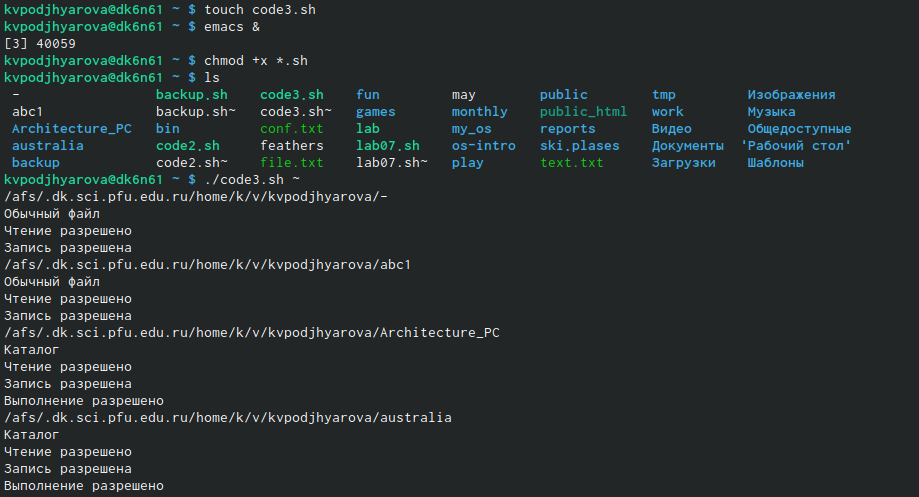{ #fig:015 width=65% }

## Задание №4

4. 1) Для четвертого скрипта создала файл и открыла его в редакторе emacs (рис. [-@fig:016])

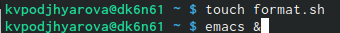{ #fig:016 width=55% }

## Скрипт 4

2) Написала командный файл, который получает в качестве аргумента командной строки формат файла и вычисляет количество таких файлов в указанной директории. Путь к директориитакже передается в виде аргумента командной строки (рис. [-@fig:017])

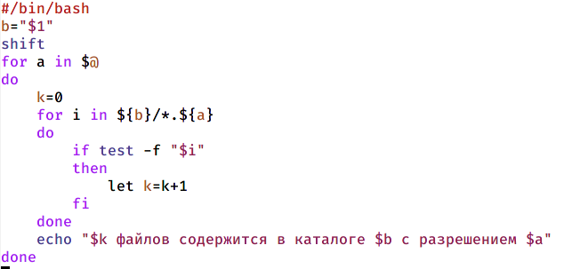{ #fig:017 width=59% }

## Проверка работы

3) Проверила работу написанного скрипта, предварительно добавив для него право на выполнение, а также создав дополнительные файлы с разными расширениями. Скрипт работает корректно(рис. [-@fig:018])

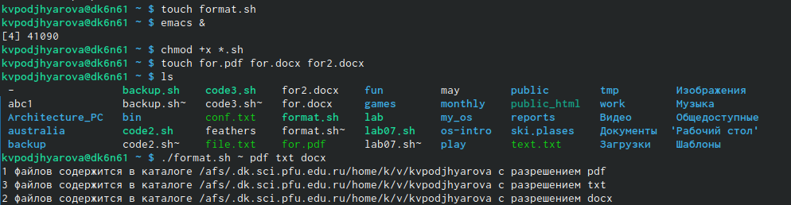{ #fig:018 width=68% }

# Выводы

В ходе выполнения лабораторной работы я изучила основы программирования в оболочке Linux и научилась писать небольшие командные файлы.

