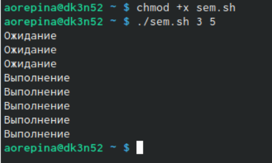
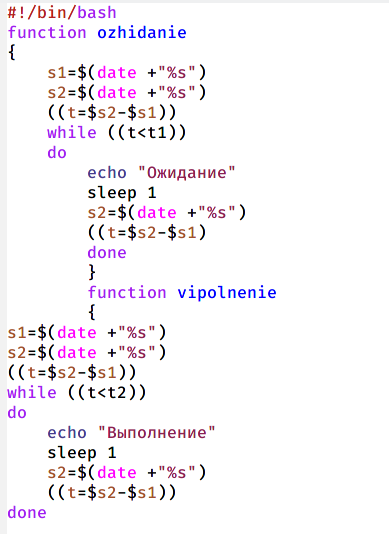
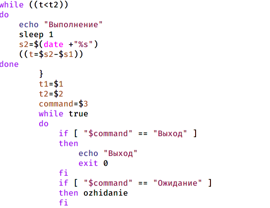
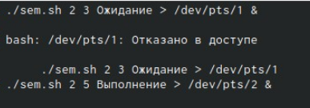
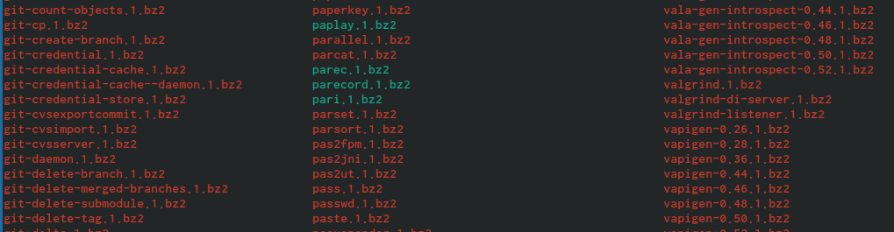
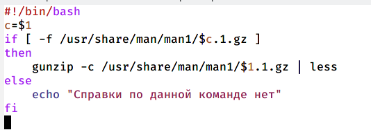
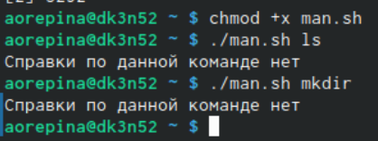
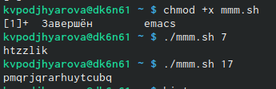

---
## Front matter
lang: ru-RU
title: Презентация по лабораторной работе №12
author: |
	Подъярова Ксения Витальевна
institute: |
	Росийский Университет Дружбы Народов

## Formatting
toc: false
slide_level: 2
theme: metropolis
header-includes: 
 - \metroset{progressbar=frametitle,sectionpage=progressbar,numbering=fraction}
 - '\makeatletter'
 - '\beamer@ignorenonframefalse'
 - '\makeatother'
aspectratio: 43
section-titles: true
---

# Цель работы

Изучить основы программирования в оболочке ОС UNIX. Научится писать более сложные командные файлы с использование млогических управляющих конструкций циклов.

# Выполнение лабораторной работы

## Задание 1

1. 1) Написала командный файл, реализующий упрощённый механизм семафоров. Командный файл должен в течение некоторого времени t1 дожидаться освобождения ресурса, выдавая об этом сообщение, а дождавшись его освобождения, использовать его в течение некоторого времени t2<>t1, также выдавая информацию о том, что ресурс используется соответствующим командным файлом (процессом). Для данной задачи я создала файл sem.sh (рис. [-@fig:001]) и написала соответствующий скрипт (рис. [-@fig:002]).

{ #fig:001 width=50% }

## Скрипт

{ #fig:002 width=30% }

## Проверка работы

2) Далее я проверила работу написанного скрипта (./sem.sh 4 7), предварительно предоставив файлу право на исполнение (chmod +x sem.sh). (рис. [-@fig:003]). Скрипт работает корректно 

{ #fig:003 width=50% }

## Изменение скрипта

  3) После этого я изменила скрипт так, чтобы его можно было выполнять в нескольких терминалах и прверила его работу ( например команда ./sem.sh 2 3 Ожидание > /dev/pts/1 &) (рис. [-@fig:004]) (рис. [-@fig:005]). После проверила работу скрипта и увидела, что мне было отказано в доступе (рис. [-@fig:006])
  
{ #fig:004 width=20% }

## Изменение скрипта

{ #fig:005 width=30% }

## Проверка работы

{ #fig:006 width=50% }

## Задание 2

2. 1) Реализовала команду man с помощью командного файла. Изучила содержимое каталога /usr/share/man/man1 (рис. [-@fig:007]). В нем находятся архивы текстовых файлов, содержащих справку по большинству установленных в системе программ и команд. Каждый архив можно открыть командой less сразу же просмотрев содержимое справки. Командный файл должен получать в виде аргумента командной строки название команды и в виде результата выдавать справку об этой команде или сообщение об отсутствии справки, если соответствующего файла нет в каталоге man1

{ #fig:007 width=50% }

## Скрипт

2) Для данной задачи я создала файл man.sh (рис. [-@fig:008]) и написала соответствующий скрипт (рис. [-@fig:009])

{ #fig:008 width=50% }

{ #fig:009 width=50% }

## Проверка работы

 3) Далее я проверила работу написанного скрипта (./man.sh ls и ./man.sh mkdir) , предварительно добавив право на исполнение файла (chmod +x man.sh) (рис. [-@fig:010]). Скрипт работает корректно.
  
{ #fig:010 width=50% }

## Задание 3

3. 1) Используя встроенную переменную $RANDOM, написала командный файл, генерирующий случайную последовательность букв латинского алфавита. Учла, что $RANDOM выдаёт псевдослучайные числа в диапазоне от 0 до 32767.Для данной задачи я создала файл mmm.sh (рис. [-@fig:011]) и написала соответствующий скрипт (рис. [-@fig:012])

{ #fig:011 width=50% }

## Скрипт

{ #fig:012 width=70% }

## Проверка работы

2) Далее я проверила работу написанного скрипта (./random.sh 7; 17), предварительно добавив право на исполднение файла (рис. [-@fig:012]). Скрипт работает корректно

{ #fig:013 width=60% }

# Выводы

В ходе выполнения лабораторной работы я изучила основы программирования в оболочке ОС UNIX и научилась писать более сложные командные файлы с использованием логических управляющих конструкций циклов.

