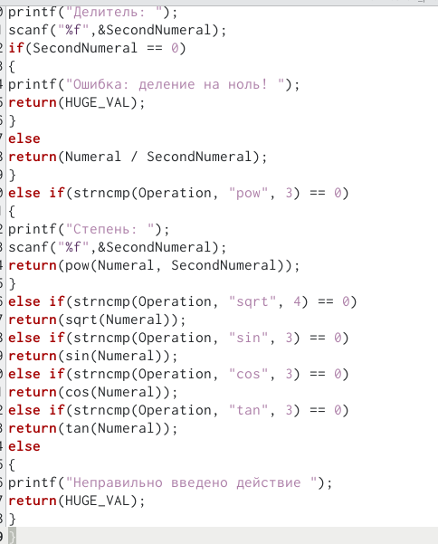
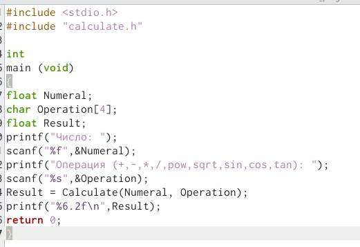
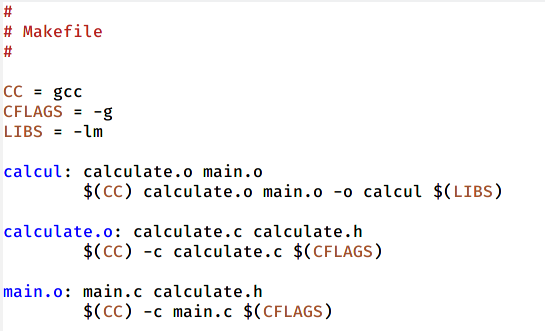
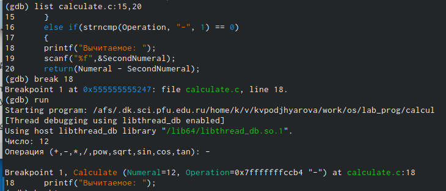
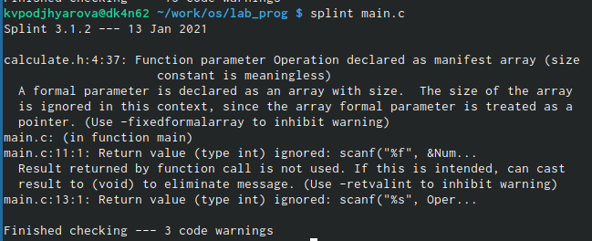
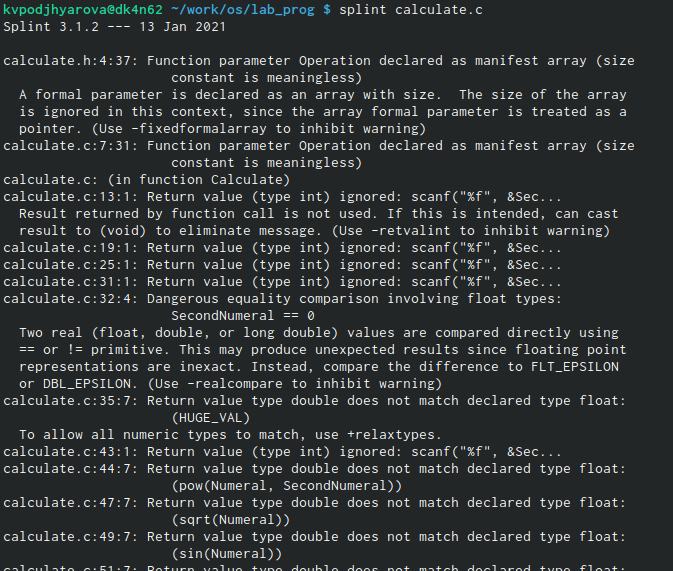

---
## Front matter
lang: ru-RU
title: Презентация по лабораторной работе №13
author: |
	Подъярова Ксения Витальевна
institute: |
	Российский Университет Дружбы Народов
date: 

## Formatting
toc: false
slide_level: 2
theme: metropolis
header-includes: 
 - \metroset{progressbar=frametitle,sectionpage=progressbar,numbering=fraction}
 - '\makeatletter'
 - '\beamer@ignorenonframefalse'
 - '\makeatother'
aspectratio: 43
section-titles: true
---

# Цель работы

Цель данной лабораторной работы - приобретение простейших навыков разработки, анализа, тестирования и отладки приложений в ОС типа Linux на примере создания на языке программирования C калькулятора с простейшими функциями.

# Выполнение лабораторной работы

1. В домашнем каталоге создала подкаталог ~/work/os/lab_prog и в нем уже создала три файла calculate.h, calculate.c, main.c (рис. [-@fig:01]). Это будет примитивнейший калькулятор, способный складывать, вычитать, умножать и делить, возводить число в степень, брать квадратный корень, вычислять sin, cos, tan. При запуске он будет запрашивать первое число, операцию, второе число. После этого программа выведет результат и остановится.

{ #fig:01 width=70% }

## Программы для работы калькулятора 

2. В созданных файлах написала программы для работы калькулятора, которые были предоставлены (рис. [-@fig:02] , [-@fig:03] , [-@fig:04] , [-@fig:05])

{ #fig:02 width=20% }

## calculate.c

{ #fig:03 width=50% }

## calculate.h

{ #fig:04 width=60% }

## main.c

{ #fig:05 width=60% }

## Компиляция

3. Выполнила компиляцию программы посредством gcc и при необходимости исправила синтаксис (рис. [-@fig:06])

{ #fig:06 width=70% }

## Makefile

4. Создала Makefile (рис. [-@fig:07]) и ввела в него предложенное содержимое (рис. [-@fig:08])

{ #fig:07 width=60% }

{ #fig:08 width=33% }

Данный файл необходим для автоматической компиляции файлов calculate.c (цель calculate.o), main.c (main.o цель), а также их объединения в один исполняемый файл calcul. Claen нужно для автоматического удаления файлов. Переменная CC отвечает за утилиту для компиляции. Переменная CFLAGS отвечает за опции в данной утилите. Переменная LIBS отвечает за опции для объединения объектных файлов в один исполняемый файл.

## Makefile исправленный

5. Далее исправила Makefile (рис. [-@fig:09]). В переменную CFLAGS добавила опцию -g необходимую для компиляции объектных файлов и их использования в программе отладчика GDВ. Сделаем так, что утилита компиляции выбирается с помощью перемнной CC

{ #fig:09 width=70% }

## Удаление исполняемых файлов и компиляция

После этого удалила исполняемые файлы (make clean) и выполнила компиляцию файлов, используя команды make calculate.o, make main.o, make calcul (рис. [-@fig:010])

{ #fig:010 width=70% }

## Отладка

6. Далее с помощью команды gdb ./calcul запустила отладку программы (рис. [-@fig:011])

{ #fig:011 width=70% }

## Запуск программы внутри отладчика

Для запуска программы внутри отладчика ввела команду run (рис. [-@fig:012])

{ #fig:012 width=70% }

## Постраничный просмотр кода

Для постраничного (по 9 строк) просмотра исходного кода использовала команду list (рис. [-@fig:013])

{ #fig:013 width=70% }

## Просмотр строк с 12 по 15

Для просмотра строк с 12 по 15 основного файла использовала list с параметрами (рис. [-@fig:014])

{ #fig:014 width=70% }

## Просмотр определённых строк

Для просмотра определенных строк не основного файла использовала list с параметрами (рис. [-@fig:015])

{ #fig:015 width=70% }

## Точка останова

Установила точку останова в файле calculate.c на строке 18 и вывела информацию об имеющихся в проекте точках (рис. [-@fig:016])

{ #fig:016 width=70% }

## Просмотр всего стека вызываемых функций

Ввела команду backtrace которая показала весь стек вызываемых функций от начала программы до текущего места (рис. [-@fig:018])

{ #fig:018 width=70% }

## Значение переменной Numeral

Посмотрела чему равно на этом этапе значение перемнной Numeral введя команду print Numeral и сравнила с результатом команды display Numeral (рис. [-@fig:019])

{ #fig:019 width=70% }

## Точки останова

Убрала точки останова (рис. [-@fig:020])

{ #fig:020 width=70% }

## Утилита split

7. С помощью утилиты splint проанализировала коды файлов calculate.c main.c . Воспользовалась командлй splint calculate.c и splint main.c (рис. [-@fig:021]) (рис. [-@fig:022]). С помощью этой команды выяснилось. что в файлах присутствует функция чтения, возвращающая целое число, но эти числа не используются и нигде не сохраняются. Утилита вывела предупреждение о том, что в файле происходит сравнение вещественного числа с нулем. Также возвращаемые значения в фугкциях записываются в переменную, что свидетельствует о потери данных

{ #fig:022 width=30% }

## splint calculate.c

{ #fig:021 width=70% }

# Выводы

В ходе данной лабораторной работы я приобрела навыки разработки, анализа, тестирования и отладки приложений в ОС на примере создания на языке программирования С калькулятора с простейшими функциями.
