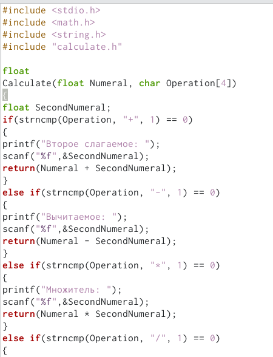
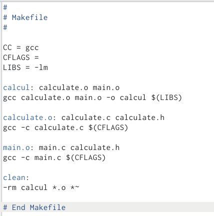
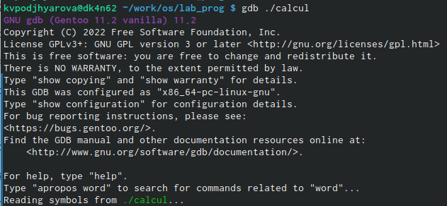
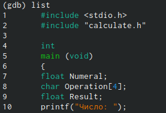

---
## Front matter
title: "Отчёт по лабораторной работе №13"
subtitle: "Дисциплина: Операционные системы"
author: "Подъярова Ксения Витальевна"

## Generic otions
lang: ru-RU
toc-title: "Содержание"

## Bibliography
bibliography: bib/cite.bib
csl: pandoc/csl/gost-r-7-0-5-2008-numeric.csl

## Pdf output format
toc: true # Table of contents
toc-depth: 2
lof: true # List of figures
lot: true # List of tables
fontsize: 12pt
linestretch: 1.5
papersize: a4
documentclass: scrreprt
## I18n polyglossia
polyglossia-lang:
  name: russian
  options:
	- spelling=modern
	- babelshorthands=true
polyglossia-otherlangs:
  name: english
## I18n babel
babel-lang: russian
babel-otherlangs: english
## Fonts
mainfont: PT Serif
romanfont: PT Serif
sansfont: PT Sans
monofont: PT Mono
mainfontoptions: Ligatures=TeX
romanfontoptions: Ligatures=TeX
sansfontoptions: Ligatures=TeX,Scale=MatchLowercase
monofontoptions: Scale=MatchLowercase,Scale=0.9
## Biblatex
biblatex: true
biblio-style: "gost-numeric"
biblatexoptions:
  - parentracker=true
  - backend=biber
  - hyperref=auto
  - language=auto
  - autolang=other*
  - citestyle=gost-numeric
## Pandoc-crossref LaTeX customization
figureTitle: "Рис."
tableTitle: "Таблица"
listingTitle: "Листинг"
lofTitle: "Список иллюстраций"
lotTitle: "Список таблиц"
lolTitle: "Листинги"
## Misc options
indent: true
header-includes:
  - \usepackage{indentfirst}
  - \usepackage{float} # keep figures where there are in the text
  - \floatplacement{figure}{H} # keep figures where there are in the text
---

# Цель работы

Цель данной лабораторной работы - приобретение простейших навыков разработки, анализа, тестирования и отладки приложений в ОС типа Linux на примере создания на языке программирования C калькулятора с простейшими функциями

# Выполнение лабораторной работы

1. В домашнем каталоге создала подкаталог ~/work/os/lab_prog и в нем уже создала три файла calculate.h, calculate.c, main.c (рис. [-@fig:01]). Это будет примитивнейший калькулятор, способный складывать, вычитать, умножать и делить, возводить число в степень, брать квадратный корень, вычислять sin, cos, tan. При запуске он будет запрашивать первое число, операцию, второе число. После этого программа выведет результат и остановится.

{ #fig:01 width=70% }

2. В созданных файлах написала программы для работы калькулятора, которые были предоставлены (рис. [-@fig:02] , [-@fig:03] , [-@fig:04] , [-@fig:05])

{ #fig:02 width=70% }

{ #fig:03 width=70% }

{ #fig:04 width=70% }

{ #fig:05 width=70% }

3. Выполнила компиляцию программы посредством gcc и при необходимости исправила синтаксис (рис. [-@fig:06])

{ #fig:06 width=70% }

4. Создала Makefile (рис. [-@fig:07]) и ввела в него предложенное содержимое (рис. [-@fig:08])

{ #fig:07 width=70% }

{ #fig:08 width=70% }

Данный файл необходим для автоматической компиляции файлов calculate.c (цель calculate.o), main.c (main.o цель), а также их объединения в один исполняемый файл calcul. Claen нужно для автоматического удаления файлов. Переменная CC отвечает за утилиту для компиляции. Переменная CFLAGS отвечает за опции в данной утилите. Переменная LIBS отвечает за опции для объединения объектных файлов в один исполняемый файл.

5. Далее исправила Makefile (рис. [-@fig:09]). В переменную CFLAGS добавила опцию -g необходимую для компиляции объектных файлов и их использования в программе отладчика GDВ. Сделаем так, что утилита компиляции выбирается с помощью перемнной CC

{ #fig:09 width=70% }

После этого удалила исполняемые файлы (make clean) и выполнила компиляцию файлов, используя команды make calculate.o, make main.o, make calcul (рис. [-@fig:010])

{ #fig:010 width=70% }

6. Далее с помощью комианды gdb ./calcul запустила отладку программы (рис. [-@fig:011])

{ #fig:011 width=70% }

Для запуска программы внутри отладчика ввела команду run (рис. [-@fig:012])

{ #fig:012 width=70% }

Для постраничного (по 9 строк) просмотра исходного кода использовала команду list (рис. [-@fig:013])

{ #fig:013 width=70% }

Для просмотра строк с 12 по 15 основного файла использовала list с параметрами (рис. [-@fig:014)

{ #fig:014 width=70% }

Для просмотра определенных строк не основного файла использовала list с параметрами (рис. [-@fig:015])

{ #fig:015 width=70% }

Установила точку останова в файле calculate.c на строке 18 и вывела информацию об имеющихся в проекте точках (рис. [-@fig:016)

{ #fig:016 width=70% }

Ввела команду backtrace которая показала весь стек вызываемых функций от начала программы до текущего места (рис. [-@fig:018])

{ #fig:018 width=70% }

Посмотрела чему равно на этом этапе значение перемнной Numeral введя команду print Numeral и сравнила с результатом команды display Numeral (рис. [-@fig:019])

{ #fig:019 width=70% }

Убрала точки останова (рис. [-@fig:020])

{ #fig:020 width=70% }

7. С помощью утилиты splint проанализировала коды файлов calculate.c main.c . Воспользовалась командлй splint calculate.c и splint main.c (рис. [-@fig:021]) (рис. [-@fig:022]). С помощью этой команды выяснилось. что в файлах присутствует функция чтения, возвращающая целое число, но эти числа не используются и нигде не сохраняются. Утилита вывела предепреждение о том, что в файлепроисходит сравнение вещественного числа с нулем. Также возвращаемые значения в фугкциях записываются в переменную, что свидетельствует о потери данных

{ #fig:021 width=70% }

{ #fig:022 width=70% }

# Выводы

В ходе данной лабораторной работы я приобрела навыки разработки, анализа, тестирования и отладки приложений в ОС на примере создания на языке программирования С калькулятора с простейшими функциями.

# Ответы на контрольные вопросы:

1. Чтобы получить информацию о возможностях программ gcc, make, gdbи др.нужно воспользоваться командой manили опцией -help(-h)для каждой команды.

2. Процесс разработки программного обеспечения обычно разделяется на следующие этапы:
    1. планирование, включающее сбор и анализ требований к функционалу и другим характеристикам разрабатываемого приложения;
    2. проектирование, включающее в себя разработку базовых алгоритмов и спецификаций, определение языка программирования;
    3. непосредственная разработка приложения: oкодирование −по сути создание исходного текста программы (возможно в нескольких вариантах); –анализ разработанного кода; oсборка, компиляция и разработка исполняемого модуля; oтестирование и отладка, сохранение произведённых изменений;
    4. документирование. Для создания исходного текста программы разработчик может воспользоваться любым удобным для него редактором текста: vi, vim, mceditor, emacs, geanyи др. После завершения написания исходного кода программы (возможно состоящей из нескольких файлов), необходимо её скомпилировать и получить исполняемый модуль.
    
3. Для имени входного файла суффикс определяет какая компиляция требуется. Суффиксы указывают на тип объекта. Файлы с расширением (суффиксом) .cвоспринимаются gccкак программы на языке С, файлы с расширением .ccили .C−как файлы на языке C++, а файлы cрасширением .oсчитаются объектными.Например, в команде «gcc-cmain.c»:gccпо расширению (суффиксу) .cраспознает тип файла для компиляции и формирует объектный модуль −файл с расширением .o. Если требуется получить исполняемый файл с определённым именем (например, hello), то требуется воспользоваться опцией -oи в качестве параметра задать имя создаваемого файла: «gcc-ohellomaiВ ходе выполнения данной лабораторной работы я приобрелапростейшие навыки разработки, анализа, тестирования и отладки приложений в ОС типа UNIX/Linuxна примере создания на языке программирования С калькулятора с простейшими функциями.n.c».

4. Основное назначение компилятора языка Си в UNIX заключается в компиляции всей программы и получении исполняемого файла/модуля.

5. Для сборки разрабатываемого приложения и собственно компиляции полезно воспользоваться утилитой make. Она позволяет автоматизировать процесс преобразования файлов программы из одной формы в другую, отслеживает взаимосвязи между файлами.

6. Для работы с утилитой makeнеобходимо в корне рабочего каталога с Вашим проектом создать файл с названием makefileили Makefile, в котором будут описаны правила обработки файлов Вашего программного комплекса. В самом простом случае Makefile имеет следующий синтаксис:   … :   …<команда 1>…Сначала задаётся список целей, разделённых пробелами, за которым идёт двоеточие и список зависимостей. Затем в следующих строках указываются команды. Строки с командами обязательно должны начинаться с табуляции. В качестве цели в Makefileможет выступать имя файла или название какого-то действия. Зависимость задаёт исходные параметры (условия) для достижения указанной цели. Зависимость также может быть названием какого-то действия. Команды − собственно действия, которые необходимо выполнить для достижения цели.Общий синтаксис Makefileимеет вид: target1 [target2…]:[:] [dependment1…][(tab)commands] [#commentary][(tab)commands] [#commentary]. Здесь знак # определяет начало комментария (содержимое от знака # и до конца строки не будет обрабатываться. Одинарное двоеточие указывает на то, что последовательность команд должна содержаться в одной строке. Для переноса можно в длинной строке команд можно использовать обратный слэш (). Двойное двоеточие указывает на то, что последовательность команд может содержаться в нескольких последовательных строках.Пример более сложного синтаксиса Makefile:## Makefile for abcd.c#CC = gccCFLAGS =# Compile abcd.c normalyabcd: abcd.c$(CC) -o abcd $(CFLAGS) abcd.cclean:-rm abcd .o ~# EndMakefileforabcd.c. В этом примере в начале файла заданы три переменные: CC и CFLAGS. Затем указаны цели, их зависимости и соответствующие команды. В командах происходит обращение к значениям переменных. Цель с именем cleanпроизводит очистку каталога от файлов, полученных в результате компиляции. Для её описания использованы регулярные выражения.

7. Во время работы над кодом программы программист неизбежно сталкивается с появлением ошибок в ней. Использование отладчика для поиска и устранения ошибок в программе существенно облегчает жизнь программиста. В комплект программ GNUдля ОС типа UNIXвходит отладчик GDB(GNUDebugger). Для использования GDB необходимо скомпилировать анализируемый код программы таким образом, чтобы отладочная информация содержалась в результирующем бинарном файле. Для этого следует воспользоваться опцией -gкомпилятора gcc: gcc-cfile.c-g. После этого для начала работы с gdbнеобходимо в командной строке ввести одноимённую команду, указав в качестве аргумента анализируемый бинарный файл: gdbfile.o

8. Основные команды отладчика gdb: 1. backtrace − вывод на экран пути к текущей точке останова (по сутивывод − названий всех функций); 2. break − установить точку останова (в качестве параметра можетбыть указан номер строки или название функции); 3. clear − удалить все точки останова в функции; 4. continue − продолжить выполнение программы; 5. delete − удалить точку останова; 6. display − добавить выражение в список выражений, значения которых отображаются при достижении точки останова программы; 7. finish − выполнить программу до момента выхода из функции; 8. info breakpoints −вывести на экран список используемых точек останова; 9. info watchpoints −вывести на экран список используемых контрольных выражений; 10. list − вывести на экран исходный код (вВ ходе выполнения данной лабораторной работы я приобрелапростейшие навыки разработки, анализа, тестирования и отладки приложений в ОС типа UNIX/Linuxна примере создания на языке программирования С калькулятора с простейшими функциями. качестве параметра может быть указано название файла и через двоеточие номера начальнойи конечной строк); 11. next − выполнить программу пошагово, но без выполнения вызываемых в программе функций; 12. print − вывести значение указываемого в качестве параметра выражения; 13. run − запуск программы на выполнение; 14. set − установить новое значение переменной; 15. step − пошаговое выполнение программы; 16. watch − установить контрольное выражение, при изменении значения которого программа будет остановлена. Для выхода из gdbможно воспользоваться командой quit (или её сокращённым вариантом q) или комбинацией клавиш Ctrl-d. Более подробную информацию по работе с gdb можно получить с помощью команд gdb-hи mangdb.

9. Cхема отладки программы показана в 6 пункте лабораторной работы.

10. При первом запуске компилятор не выдал никаких ошибок, но в коде программы main.c допущена ошибка, которую компилятор мог пропустить (возможно, из-за версии 8.3.0-19): в строке scanf(“%s”, &Operation); нужно убрать знак &, потому что имя массивасимволов уже является указателемна первый элементэтого массива.

11. Система разработки приложений UNIX предоставляет различные средства, повышающие понимание исходного кода. К ним относятся:cscope −исследование функций, содержащихся в программе,int −критическая проверка программ, написанных на языке Си.

12. Утилита splint анализирует программный код, проверяет корректность задания аргументов использованных в программе функций и типов возвращаемых значений, обнаруживает синтаксические и семантические ошибки. В отличие от компилятора Cанализатор splintгенерирует комментарии с описанием разбора кода программы и осуществляет общий контроль, обнаруживая такие ошибки, как одинаковые объекты, определённые в разных файлах, или объекты, чьи значения не используются в работt программы, переменные с некорректно заданными значениямии типами и многое другое.

