---
## Front matter
lang: ru-RU
title: Презентация по 1 этапу индивидуального проекта
author: |
	Подъярова Ксения Витальевна (группа: НПМбд-02-21)
institute: |
	Российский Университет Дружбы Народов

## Formatting
toc: false
slide_level: 2
theme: metropolis
header-includes: 
 - \metroset{progressbar=frametitle,sectionpage=progressbar,numbering=fraction}
 - '\makeatletter'
 - '\beamer@ignorenonframefalse'
 - '\makeatother'
aspectratio: 43
section-titles: true
---

## Цель работы

Размещение на Github pages заготовки для персонального сайта.

# Выполнение 1 этапа индивидуального проекта

## Копирование шаблона в наш репозиторий

Скачиваем шаблон темы сайта и переносим его в наш репозиторий (рис. [-@fig:001])

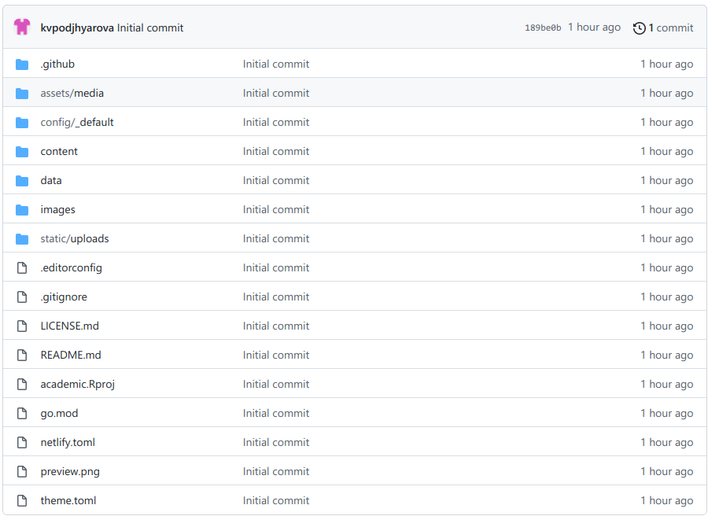{ #fig:001 width=70% }

## Размещение на хостинге

Размещаем его на хостинге git (рис. [-@fig:002])

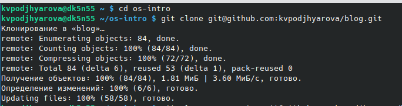{ #fig:002 width=70% }

## URLs сайта

Устанавливаем параметр для URLs сайта (рис. [-@fig:003])

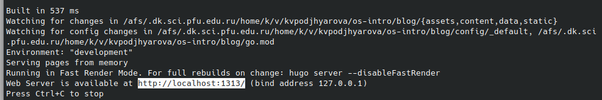{ #fig:003 width=70% }

## Размещаем заготовку сайта на Github pages.

Создаем пустой репозиторий с именем kvpodjhyarova.github.io (рис. [-@fig:004])

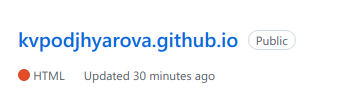{ #fig:004 width=70% }

## Клонирование репозитория

Клонируем созданный репозиторий (рис. [-@fig:005])

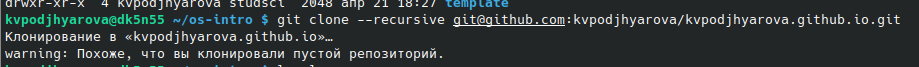{ #fig:005 width=70% }

## Создание файла README.md

Переходим на главную ветку репозитория и создаем пустой файл README.md (рис. [-@fig:006])

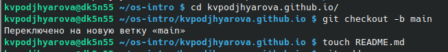{ #fig:006 width=70% }

## Добавление файлов в репозиторий

Перекидываем файл в репозиторий на GitHub (рис. [-@fig:007])

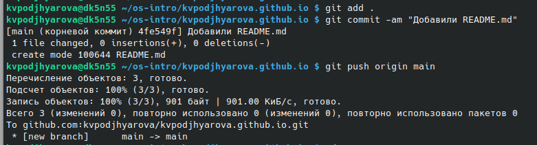{ #fig:007 width=70% }

## Создаем каталог public и привязываем к нему репозиторий kvpodjhyarova.github.io.

Репозиторий не привязывается, так как public игнорируется (рис. [-@fig:008])

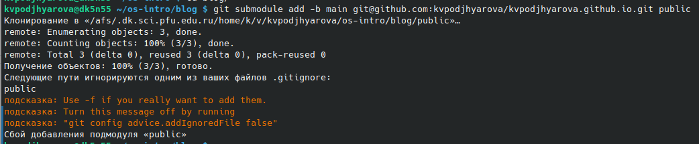{ #fig:008 width=70% }

## Убираем игнорирование public

Переходим в gitignore и убираем игнорирование public (рис. [-@fig:009])

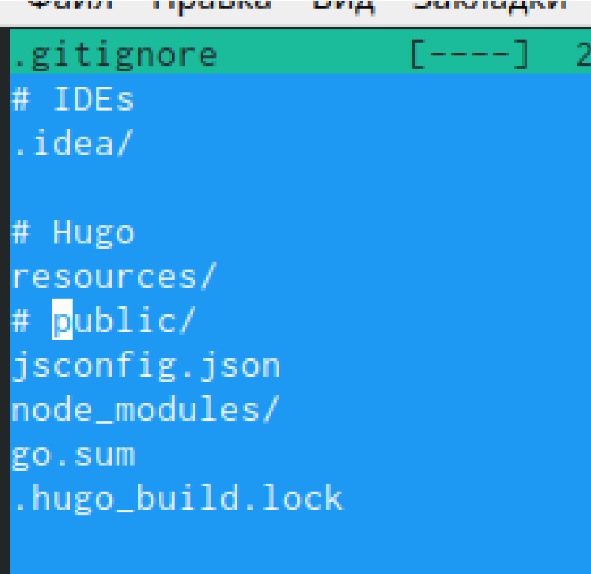{ #fig:009 width=60% }

## Привязка репозитория

Снова привязываем репозиторий и нам это удается (рис. [-@fig:010])

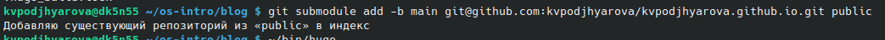{ #fig:010 width=70% }

## Компелируем файлы

Вызываем hugo, чтобы скомпелировать файлы (рис. [-@fig:011])

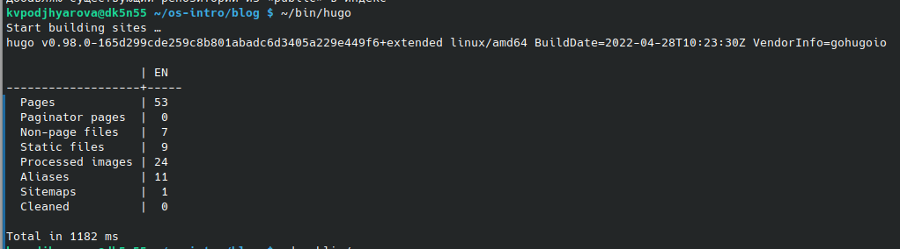{ #fig:011 width=70% }

## Загрузка на GitHub

Загружаем все на GitHub (рис. [-@fig:012]) (рис. [-@fig:013])

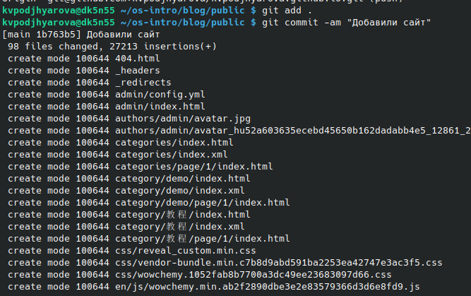{ #fig:012 width=50% }

{ #fig:013 width=50% }

## Проверка выгрузки файлов на GitHub

Проверяем выгрузку файлов на GitHub (рис. [-@fig:014])

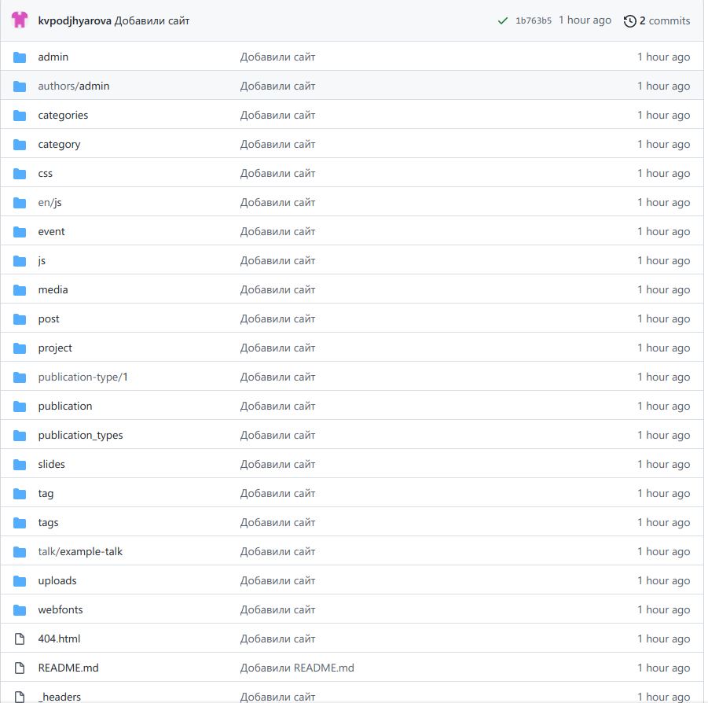{ #fig:014 width=50% }

## Итоговый сайт

Итоговый сайт (рис. [-@fig:015])

{ #fig:015 width=55% }

# Выводы

Я научилась использовать шаблоны сайта с GitHub и размещать на GitHub pages заготовки для персонального сайта.

