---
## Front matter
title: "Отчет по 1 этапу индивидуального проекта"
subtitle: "дисциплина: Операционные системы"
author: "Подъярова Ксения Витальевна (группа:НПМбд-02-21)"

## Generic otions
lang: ru-RU
toc-title: "Содержание"

## Bibliography
bibliography: bib/cite.bib
csl: pandoc/csl/gost-r-7-0-5-2008-numeric.csl

## Pdf output format
toc: true # Table of contents
toc-depth: 2
lof: true # List of figures
lot: true # List of tables
fontsize: 12pt
linestretch: 1.5
papersize: a4
documentclass: scrreprt
## I18n polyglossia
polyglossia-lang:
  name: russian
  options:
	- spelling=modern
	- babelshorthands=true
polyglossia-otherlangs:
  name: english
## I18n babel
babel-lang: russian
babel-otherlangs: english
## Fonts
mainfont: PT Serif
romanfont: PT Serif
sansfont: PT Sans
monofont: PT Mono
mainfontoptions: Ligatures=TeX
romanfontoptions: Ligatures=TeX
sansfontoptions: Ligatures=TeX,Scale=MatchLowercase
monofontoptions: Scale=MatchLowercase,Scale=0.9
## Biblatex
biblatex: true
biblio-style: "gost-numeric"
biblatexoptions:
  - parentracker=true
  - backend=biber
  - hyperref=auto
  - language=auto
  - autolang=other*
  - citestyle=gost-numeric
## Pandoc-crossref LaTeX customization
figureTitle: "Рис."
tableTitle: "Таблица"
listingTitle: "Листинг"
lofTitle: "Список иллюстраций"
lotTitle: "Список таблиц"
lolTitle: "Листинги"
## Misc options
indent: true
header-includes:
  - \usepackage{indentfirst}
  - \usepackage{float} # keep figures where there are in the text
  - \floatplacement{figure}{H} # keep figures where there are in the text
---

# Цель работы

Размещение на Github pages заготовки для персонального сайта.

# Выполнение 1 этапа индивидуального проекта

1. Скачиваем шаблон темы сайта и переносим его в наш репозиторий (рис. [-@fig:001])

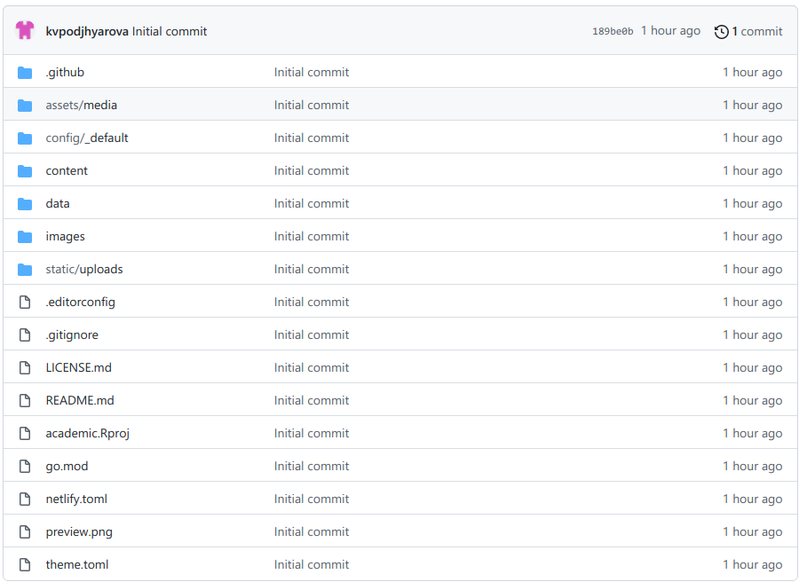{ #fig:001 width=70% }

2. Размещаем его на хостинге git (рис. [-@fig:002])

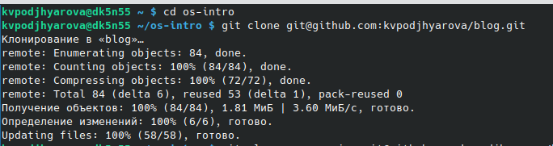{ #fig:002 width=70% }

3. Устанавливаем параметр для URLs сайта (рис. [-@fig:003])

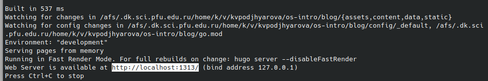{ #fig:003 width=70% }

4. Размещаем заготовку сайта на Github pages.

1) Создаем пустой репозиторий с именем kvpodjhyarova.github.io (рис. [-@fig:004])

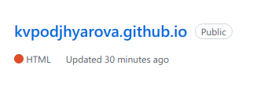{ #fig:004 width=70% }

2) Клонируем созданный репозиторий (рис. [-@fig:005])

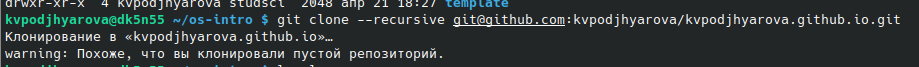{ #fig:005 width=70% }

3) Переходим на главную ветку репозитория и создаем пустой файл README.md (рис. [-@fig:006])

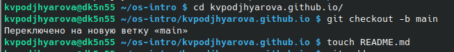{ #fig:006 width=70% }

4) Перекидываем файл в репозиторий на GitHub (рис. [-@fig:007])

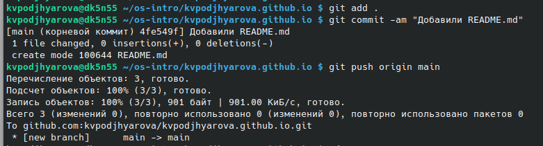{ #fig:007 width=70% }

5) Создаем каталог public и привязываем к нему репозиторий kvpodjhyarova.github.io.

  1) Репозиторий не привязывается, так как public игнорируется (рис. [-@fig:008])

{ #fig:008 width=70% }

  2) Переходим в gitignore и убираем игнорирование public (рис. [-@fig:009])

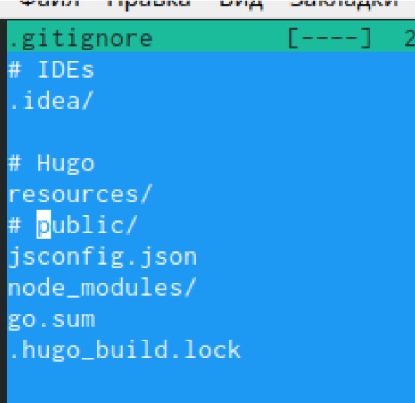{ #fig:009 width=60% }

  3) Снова привязываем репозиторий и нам это удается (рис. [-@fig:010])

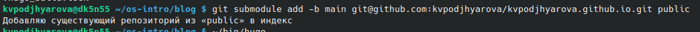{ #fig:010 width=70% }

6) Вызываем hugo, чтобы скомпелировать файлы (рис. [-@fig:011])

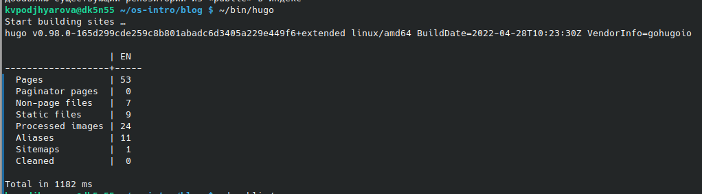{ #fig:011 width=70% }

7) Загружаем все на GitHub (рис. [-@fig:012]) (рис. [-@fig:013])

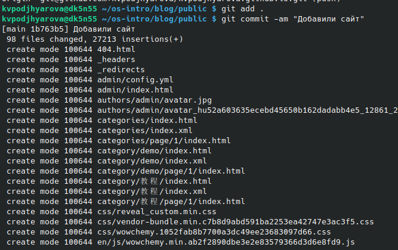{ #fig:012 width=55% }

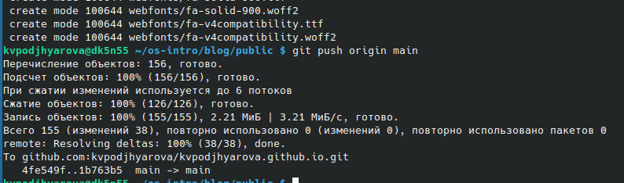{ #fig:013 width=60% }

8) Проверяем выгрузку файлов на GitHub (рис. [-@fig:014])

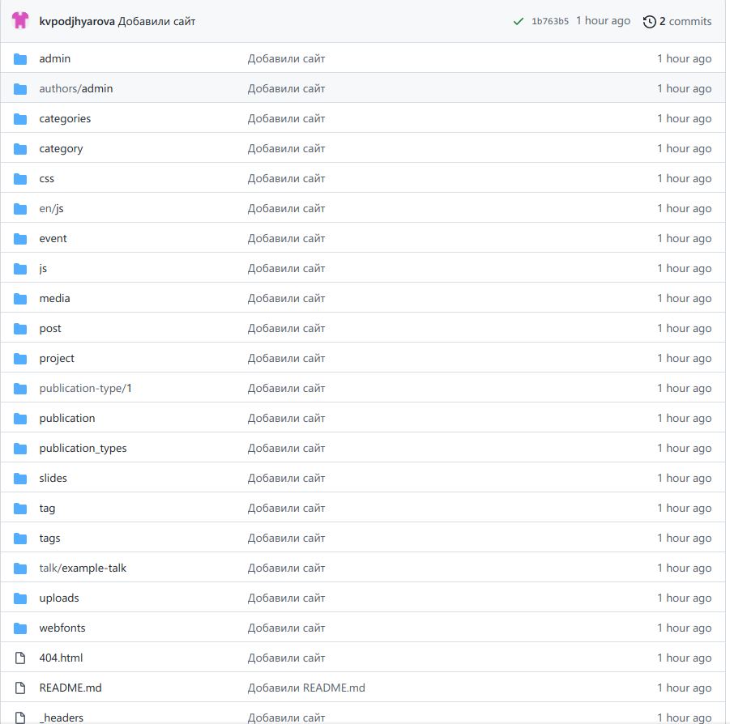{ #fig:014 width=60% }

9) Итоговый сайт (рис. [-@fig:015])

{ #fig:015 width=55% }

# Выводы

Я научилась использовать шаблоны сайта с GitHub и размещать на GitHub pages заготовки для персонального сайта.

