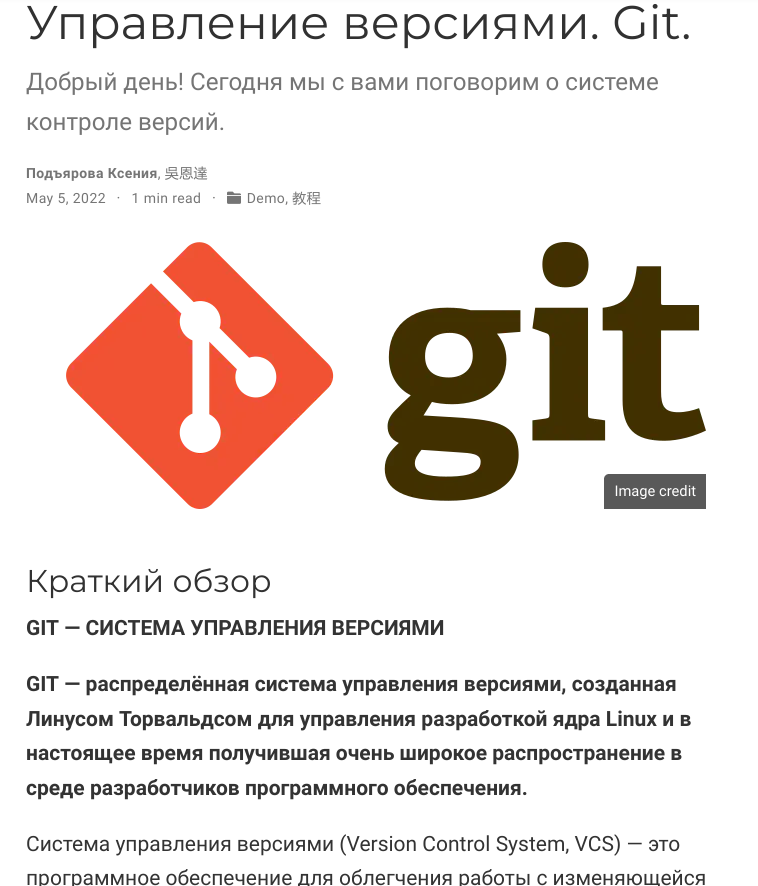

---
## Front matter
lang: ru-RU
title: Презентация по 2 этапу индивидуального проекта
author: |
	Подъярова Ксения Витальевна (группа: НПМбд-02-21)
institute: |
	Российский Университет Дружбы Народов

## Formatting
toc: false
slide_level: 2
theme: metropolis
header-includes: 
 - \metroset{progressbar=frametitle,sectionpage=progressbar,numbering=fraction}
 - '\makeatletter'
 - '\beamer@ignorenonframefalse'
 - '\makeatother'
aspectratio: 43
section-titles: true
---

# Цель работы

Добавить к сайту данные о себе и сделать 2 поста.

# Задание

Добавить к сайту данные о себе

1. Список добавляемых данных.

   - Разместить фотографию владельца сайта.
   
   - Разместить краткое описание владельца сайта (Biography).
   
   - Добавить информацию об интересах (Interests).
   
   - Добавить информацию от образовании (Education).
   
2. Сделать пост по прошедшей неделе.

3. Добавить пост на тему по выбору:

   - Управление версиями. Git.
   
   - Непрерывная интеграция и непрерывное развертывание (CI/CD).

# Выполнение 2 этапа индивидуального проекта

## Размещение фотографии

1. Размещаю фотографию на сайте, добавив изображение в /blog/content/authors/admin (рис. [-@fig:001])

{ #fig:001 width=50% }

## Размещение краткой информации

2. Размещаю краткое описание владельца сайта (Biography), изменив файл _index.md в /blog/content/authors/admin (рис. [-@fig:002])

{ #fig:002 width=70% }

## Добавление информации об интересах

3. Добавляю информацию об интересах (Interests), изменив файл _index.md в /blog/content/authors/admin (рис. [-@fig:003])

{ #fig:003 width=60% }

## Добавление информации об образовании

4. Добавляю информацию от образовании (Education), изменив файл _index.md в /blog/content/authors/admin (рис. [-@fig:004])

{ #fig:004 width=60% }

## Создание нового поста

5. Создаю новый пост, изменив файл index.md в /blog/content/post/getting-started (рис. [-@fig:005]) (рис. [-@fig:006])

{ #fig:005 width=80% }

## Создание нового поста

{ #fig:006 width=70% }

## Добавление поста на тему "Управление версиями. Git"

6. Добавляю пост на тему "Управление версиями. Git". Для этого в папке post создаю новую папку "Пост" и изменяю файл index.md (рис. [-@fig:007]) (рис. [-@fig:008])

{ #fig:007 width=70% }

## Добавление поста на тему "Управление версиями. Git"

{ #fig:008 width=56% }

# Выводы

Я научилась добавлять к сайту данные о себе и создавать новые посты.

