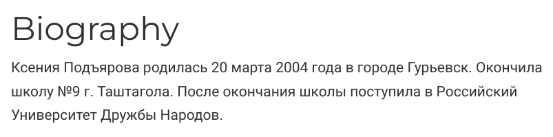
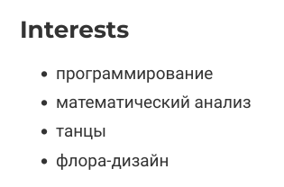
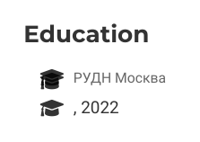
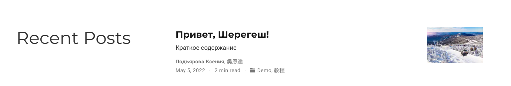
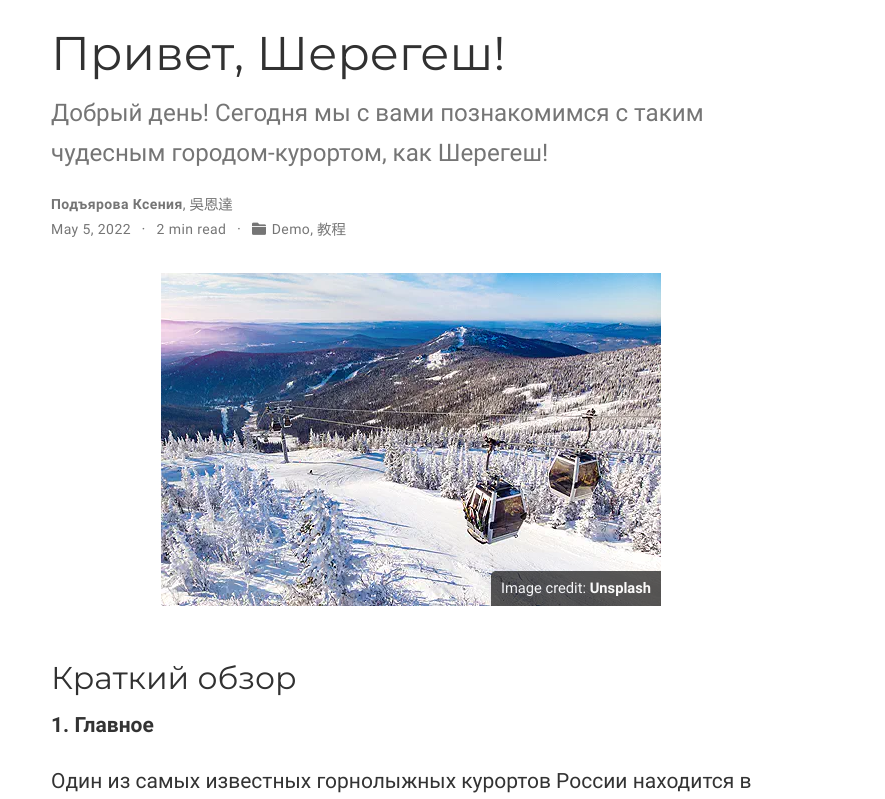
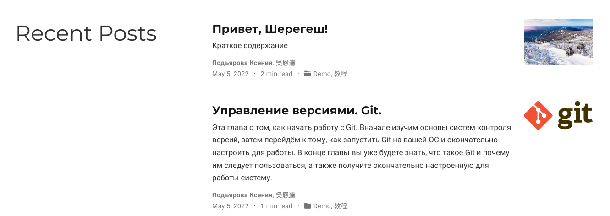
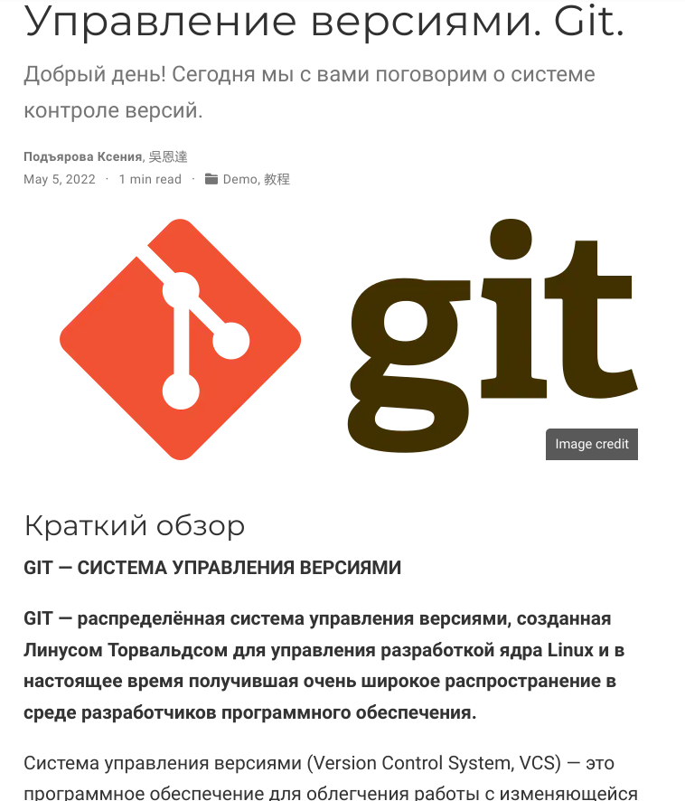

---
## Front matter
title: "Отчёт по 2 этапу индивидуального проекта"
subtitle: "Дисциплина: Операционные системы"
author: "Подъярова Ксения Витальевна (группа: НПМбд-02-21)"

## Generic otions
lang: ru-RU
toc-title: "Содержание"

## Bibliography
bibliography: bib/cite.bib
csl: pandoc/csl/gost-r-7-0-5-2008-numeric.csl

## Pdf output format
toc: true # Table of contents
toc-depth: 2
lof: true # List of figures
lot: true # List of tables
fontsize: 12pt
linestretch: 1.5
papersize: a4
documentclass: scrreprt
## I18n polyglossia
polyglossia-lang:
  name: russian
  options:
	- spelling=modern
	- babelshorthands=true
polyglossia-otherlangs:
  name: english
## I18n babel
babel-lang: russian
babel-otherlangs: english
## Fonts
mainfont: PT Serif
romanfont: PT Serif
sansfont: PT Sans
monofont: PT Mono
mainfontoptions: Ligatures=TeX
romanfontoptions: Ligatures=TeX
sansfontoptions: Ligatures=TeX,Scale=MatchLowercase
monofontoptions: Scale=MatchLowercase,Scale=0.9
## Biblatex
biblatex: true
biblio-style: "gost-numeric"
biblatexoptions:
  - parentracker=true
  - backend=biber
  - hyperref=auto
  - language=auto
  - autolang=other*
  - citestyle=gost-numeric
## Pandoc-crossref LaTeX customization
figureTitle: "Рис."
tableTitle: "Таблица"
listingTitle: "Листинг"
lofTitle: "Список иллюстраций"
lotTitle: "Список таблиц"
lolTitle: "Листинги"
## Misc options
indent: true
header-includes:
  - \usepackage{indentfirst}
  - \usepackage{float} # keep figures where there are in the text
  - \floatplacement{figure}{H} # keep figures where there are in the text
---

# Цель работы

Добавить к сайту данные о себе и сделать 2 поста.

# Задание

Добавить к сайту данные о себе

1. Список добавляемых данных.

   - Разместить фотографию владельца сайта.
   
   - Разместить краткое описание владельца сайта (Biography).
   
   - Добавить информацию об интересах (Interests).
   
   - Добавить информацию от образовании (Education).
   
2. Сделать пост по прошедшей неделе.

3. Добавить пост на тему по выбору:

   - Управление версиями. Git.
   
   - Непрерывная интеграция и непрерывное развертывание (CI/CD).

# Выполнение 2 этапа индивидуального проекта

1. Размещаю фотографию на сайте, добавив изображение в /blog/content/authors/admin (рис. [-@fig:001])

{ #fig:001 width=70% }

2. Размещаю краткое описание владельца сайта (Biography), изменив файл _index.md в /blog/content/authors/admin (рис. [-@fig:002])

{ #fig:002 width=70% }

3. Добавляю информацию об интересах (Interests), изменив файл _index.md в /blog/content/authors/admin (рис. [-@fig:003])

{ #fig:003 width=70% }

4. Добавляю информацию от образовании (Education), изменив файл _index.md в /blog/content/authors/admin (рис. [-@fig:004])

{ #fig:004 width=70% }

5. Создаю новый пост, изменив файл index.md в /blog/content/post/getting-started (рис. [-@fig:005]) (рис. [-@fig:006])

{ #fig:005 width=70% }

{ #fig:006 width=30% }

6. Добавляю пост на тему "Управление версиями. Git". Для этого в папке post создаю новую папку "Пост" и изменяю файл index.md (рис. [-@fig:007]) (рис. [-@fig:008])

{ #fig:007 width=70% }

{ #fig:008 width=30% }

# Выводы

Я научилась добавлять к сайту данные о себе и создавать новые посты.

