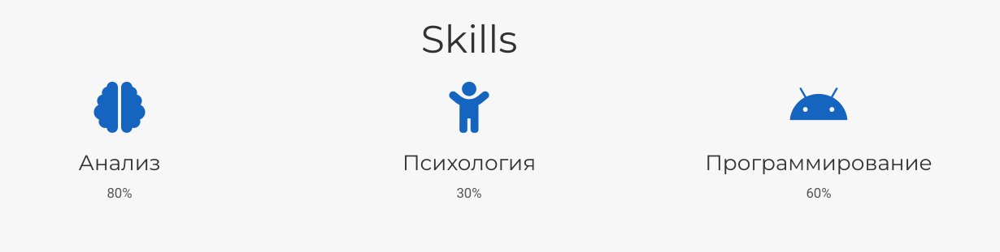
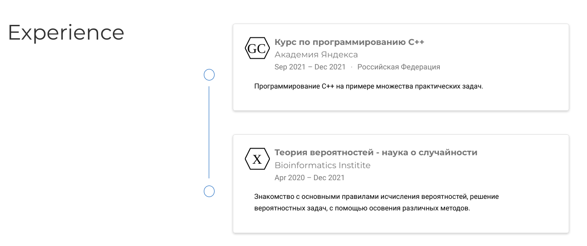
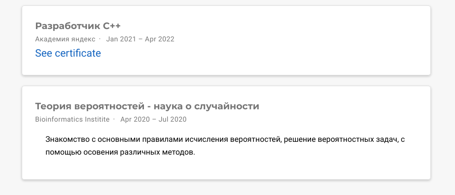
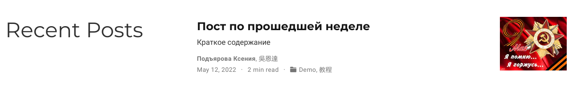
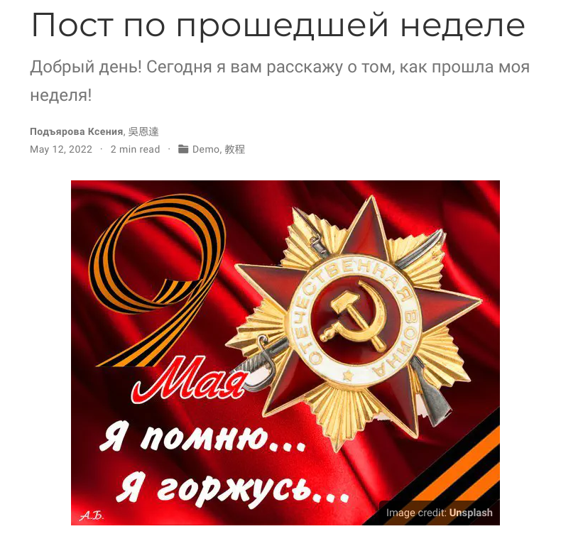
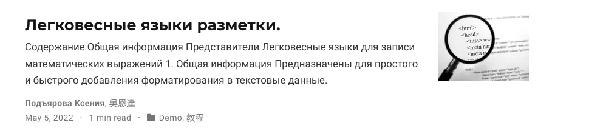
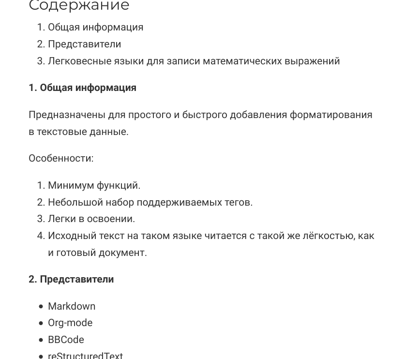

---
## Front matter
lang: ru-RU
title: Презентация по 3 этапу индивидуального проекта
author: |
	Подъярова Ксения Витальевна (группа: НПМбд-02-21)
institute: |
	Российский Университет Дружбы Народов

## Formatting
toc: false
slide_level: 2
theme: metropolis
header-includes: 
 - \metroset{progressbar=frametitle,sectionpage=progressbar,numbering=fraction}
 - '\makeatletter'
 - '\beamer@ignorenonframefalse'
 - '\makeatother'
aspectratio: 43
section-titles: true
---

# Цель работы

Добавить к сайту достижения и сделать 2 поста.

# Задание

Добавить к сайту достижения.

1. Список достижений.

   * Добавить информацию о навыках (Skills).
   
   * Добавить информацию об опыте (Experience).
   
   * Добавить информацию о достижениях (Accomplishments).
   
2. Сделать пост по прошедшей неделе.

3. Добавить пост на тему по выбору:

   * Легковесные языки разметки.
   
   * Языки разметки. LaTeX.
   
   * Язык разметки Markdown.

# Выполнение 3 этапа индивидуального проекта

## Добавление информации о навыках

1. Добавляю информацию о навыках (Skills), изменив файл skills.md в /blog/content/home (рис. [-@fig:001])

{ #fig:001 width=55% }

## Добавление информации об опыте

2. Добавляю информацию об опыте (Experience), изменив файл experience.md в /blog/content/home (рис. [-@fig:002])

{ #fig:002 width=55% }

## Добавление информации о достижениях

3. Добавляю информацию о достижениях (Accomplishments), изменив файл аccomplishments.md в /blog/content/home (рис. [-@fig:003])

{ #fig:003 width=55% }

## Создание поста по прошедшей неделе

4. Добавляю пост по прошедшей неделе. Для этого в папке post создаю новую папку "Post2" и изменяю файл index.md (рис. [-@fig:004]) (рис. [-@fig:005])

{ #fig:004 width=40% }

{ #fig:005 width=30% }

## Добавление поста на тему "Легковесные языки разметки"

4. Добавляю пост на тему "Легковесные языки разметки". Для этого в папке post создаю новую папку "Post3" и изменяю файл index.md (рис. [-@fig:006]) (рис. [-@fig:007])

{ #fig:006 width=40% }

{ #fig:007 width=30% }

# Выводы

Я научилась добавлять к сайту достижения и добавлять новые посты.

