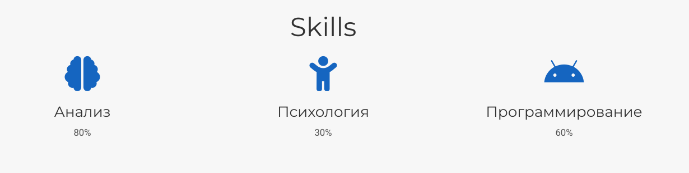

---
## Front matter
title: "Отчёт по 3 этапу индивидуального проекта"
subtitle: "Дисциплина: Операционные системы"
author: "Подъярова Ксения Витальевна (группа: НПМбд-02-21)"

## Generic otions
lang: ru-RU
toc-title: "Содержание"

## Bibliography
bibliography: bib/cite.bib
csl: pandoc/csl/gost-r-7-0-5-2008-numeric.csl

## Pdf output format
toc: true # Table of contents
toc-depth: 2
lof: true # List of figures
lot: true # List of tables
fontsize: 12pt
linestretch: 1.5
papersize: a4
documentclass: scrreprt
## I18n polyglossia
polyglossia-lang:
  name: russian
  options:
	- spelling=modern
	- babelshorthands=true
polyglossia-otherlangs:
  name: english
## I18n babel
babel-lang: russian
babel-otherlangs: english
## Fonts
mainfont: PT Serif
romanfont: PT Serif
sansfont: PT Sans
monofont: PT Mono
mainfontoptions: Ligatures=TeX
romanfontoptions: Ligatures=TeX
sansfontoptions: Ligatures=TeX,Scale=MatchLowercase
monofontoptions: Scale=MatchLowercase,Scale=0.9
## Biblatex
biblatex: true
biblio-style: "gost-numeric"
biblatexoptions:
  - parentracker=true
  - backend=biber
  - hyperref=auto
  - language=auto
  - autolang=other*
  - citestyle=gost-numeric
## Pandoc-crossref LaTeX customization
figureTitle: "Рис."
tableTitle: "Таблица"
listingTitle: "Листинг"
lofTitle: "Список иллюстраций"
lotTitle: "Список таблиц"
lolTitle: "Листинги"
## Misc options
indent: true
header-includes:
  - \usepackage{indentfirst}
  - \usepackage{float} # keep figures where there are in the text
  - \floatplacement{figure}{H} # keep figures where there are in the text
---

# Цель работы

Добавить к сайту достижения и сделать 2 поста.

# Задание

Добавить к сайту достижения.

1. Список достижений.

   * Добавить информацию о навыках (Skills).
   
   * Добавить информацию об опыте (Experience).
   
   * Добавить информацию о достижениях (Accomplishments).
   
2. Сделать пост по прошедшей неделе.

3. Добавить пост на тему по выбору:

   * Легковесные языки разметки.
   
   * Языки разметки. LaTeX.
   
   * Язык разметки Markdown.

# Выполнение 3 этапа индивидуального проекта

1. Добавляю информацию о навыках (Skills), изменив файл skills.md в /blog/content/home (рис. [-@fig:001])

{ #fig:001 width=55% }

2. Добавляю информацию об опыте (Experience), изменив файл experience.md в /blog/content/home (рис. [-@fig:002])

{ #fig:002 width=55% }

3. Добавляю информацию о достижениях (Accomplishments), изменив файл аccomplishments.md в /blog/content/home (рис. [-@fig:003])

{ #fig:003 width=55% }

4. Добавляю пост по прошедшей неделе. Для этого в папке post создаю новую папку "Post2" и изменяю файл index.md (рис. [-@fig:004]) (рис. [-@fig:005])

{ #fig:004 width=55% }

{ #fig:005 width=50% }

4. Добавляю пост на тему "Легковесные языки разметки.". Для этого в папке post создаю новую папку "Post3" и изменяю файл index.md (рис. [-@fig:006]) (рис. [-@fig:007])

{ #fig:006 width=55% }

{ #fig:007 width=45% }

# Выводы

Я научилась добавлять к сайту достижения и добавлять новые посты.

