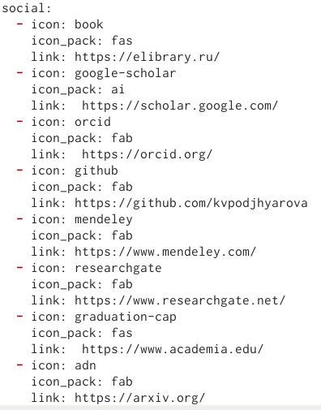
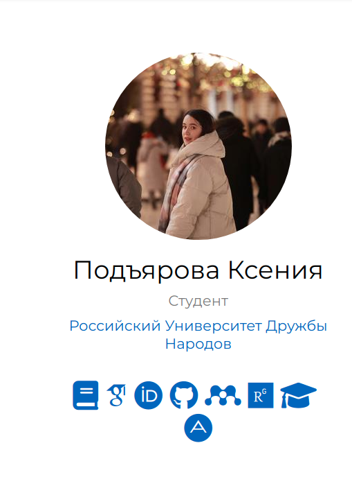
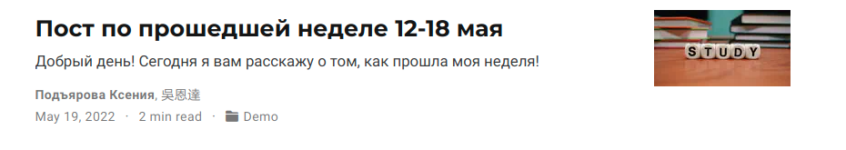
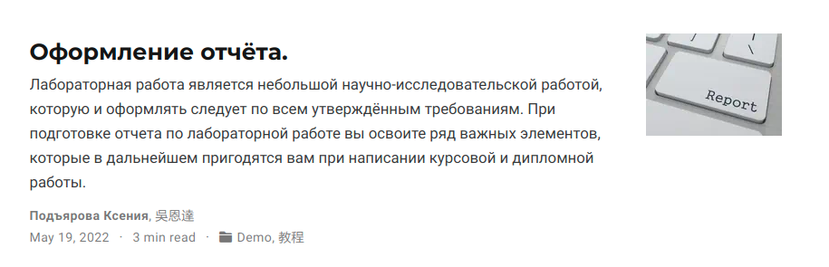
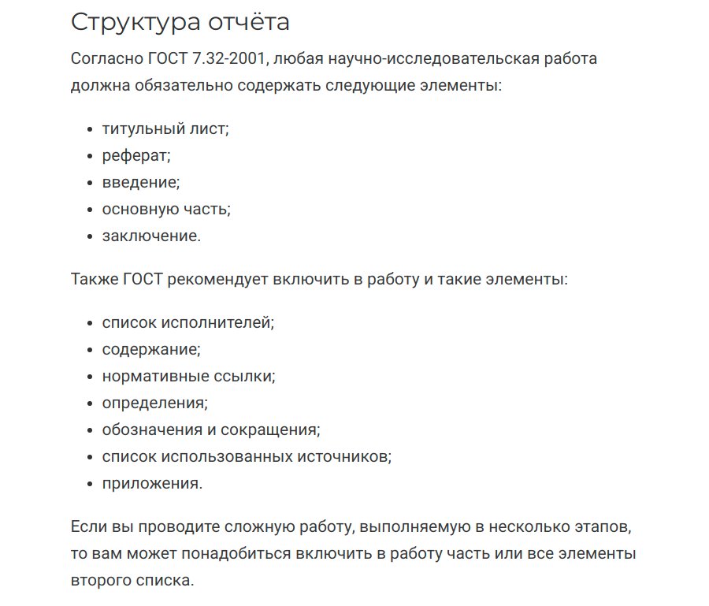

---
## Front matter
lang: ru-RU
title: Презентация по 4 этапу индивидуального проекта
author: |
	Подъярова Ксения Витальевна
institute: |
	Российский Университет Дружбы Народов

## Formatting
toc: false
slide_level: 2
theme: metropolis
header-includes: 
 - \metroset{progressbar=frametitle,sectionpage=progressbar,numbering=fraction}
 - '\makeatletter'
 - '\beamer@ignorenonframefalse'
 - '\makeatother'
aspectratio: 43
section-titles: true
---

# Цель работы

Добавить к сайту ссылки на научные и библиометрические ресурсы. Cделать 2 поста.

# Задание

1. Зарегистрироваться на соответствующих ресурсах и разместить на них ссылки на сайте:

  * eLibrary

  * Google Scholar

  * ORCID

  * Mendeley

  * ResearchGate

  * Academia.edu

  * arXiv

  * github
  
## Задание

2. Сделать пост по прошедшей неделе.

3. Добавить пост на тему по выбору:

  * Оформление отчёта.
  
  * Создание презентаций.
  
  * Работа с библиографией.

# Выполнение 4 этапа индивидуального проекта

## Добавление ссылок на ресурсы

1. Регистрируюсь на соответствующих ресурсах и размещаю на них ссылки на сайте, изменив файл index.md в /blog/content/authors/admin (рис. [-@fig:001]) (рис. [-@fig:002])

{ #fig:001 width=40% }

## Размещение ссылок на сайте

{ #fig:002 width=40% }

## Создание поста по прошедшей неделе

2. Добавляю пост по прошедшей неделе. Для этого в папке post создаю новую папку "Post4" и изменяю файл index.md (рис. [-@fig:003]) (рис. [-@fig:004])

{ #fig:003 width=65% }

## Создание поста по прошедшей неделе

{ #fig:004 width=55% }

## Добавление поста на тему "Оформление отчёта"

4. Добавляю пост на тему "Оформление отчёта". Для этого в папке post создаю новую папку "Post5" и изменяю файл index.md (рис. [-@fig:005]) (рис. [-@fig:006])

{ #fig:005 width=65% }

## Добавление поста на тему "Оформление отчёта"

{ #fig:006 width=55% }

# Выводы

Я научилась добавлять к сайту ссылки на научные и библиометрические ресурсы.

