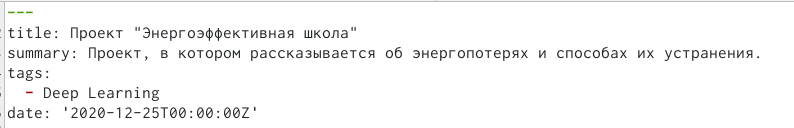
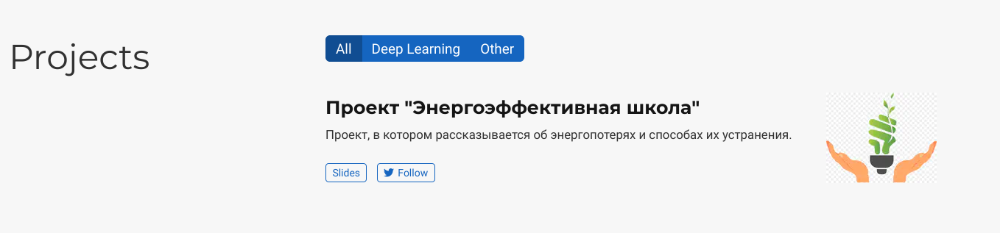
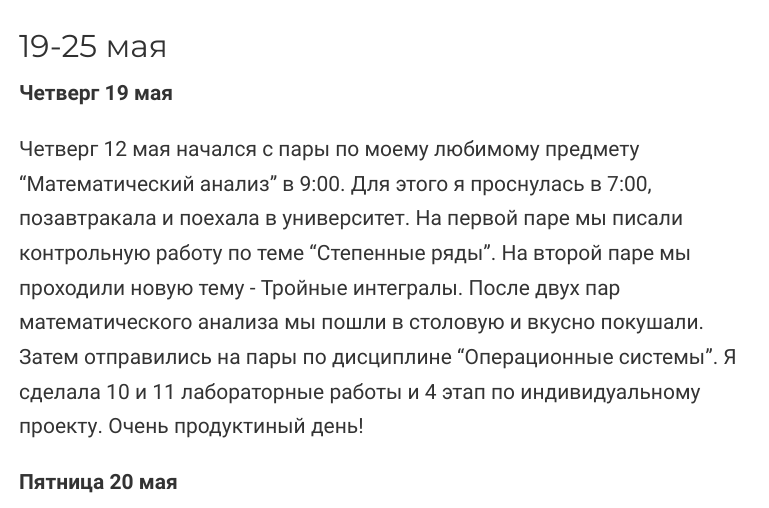
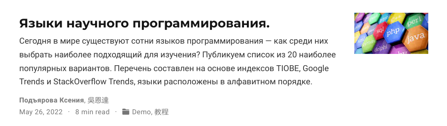
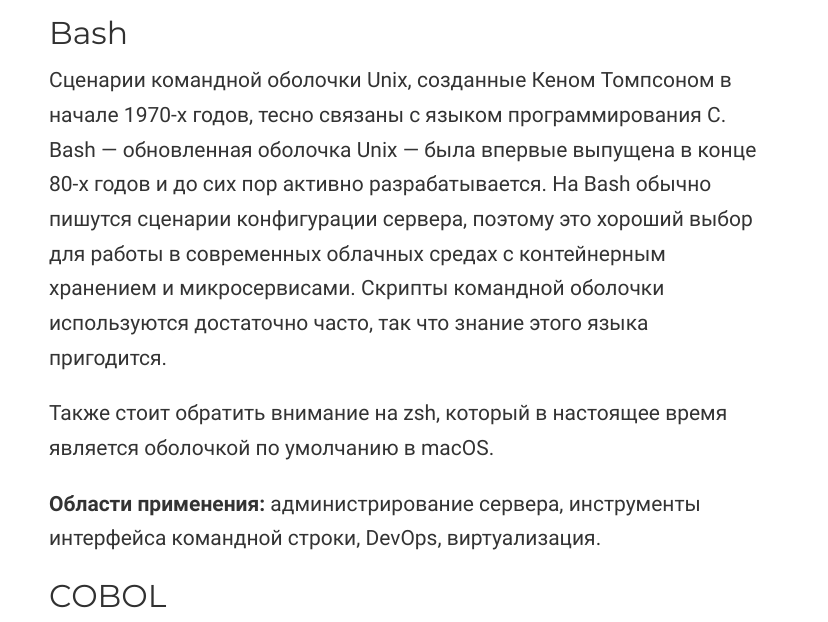

---
## Front matter
lang: ru-RU
title: Презентация по 5 этапу индивидуального проекта
author: |
	Подъярова Ксения Витальевна
institute: |
	Российский Университет Дружбы Народов

## Formatting
toc: false
slide_level: 2
theme: metropolis
header-includes: 
 - \metroset{progressbar=frametitle,sectionpage=progressbar,numbering=fraction}
 - '\makeatletter'
 - '\beamer@ignorenonframefalse'
 - '\makeatother'
aspectratio: 43
section-titles: true
---

# Цель работы

Добавить к сайту все остальные элементы. Cделать 2 поста.

# Задание

1. Сделать записи для персональных проектов.

2. Сделать пост по прошедшей неделе.

3. Добавить пост на тему "Языки научного программирования".
  

# Выполнение 4 этапа индивидуального проекта

## Создание записи для персоального проекта

1. Создаю запись для персонального проекта, изменив файл index.md в /blog/content/project (рис. [-@fig:001]) (рис. [-@fig:002])

{ #fig:001 width=55% }

## Размещение проекта на сайте

{ #fig:002 width=55% }

## Создание поста по прошедшей неделе

2. Добавляю пост по прошедшей неделе. Для этого в папке post создаю новую папку "Post6" и изменяю файл index.md (рис. [-@fig:003]) (рис. [-@fig:004])

{ #fig:003 width=55% }

## Создание поста по прошедшей неделе

{ #fig:004 width=55% }

## Добавление поста на тему "Языки научного программирования"

3. Добавляю пост на тему "Языки научного программирования". Для этого в папке post создаю новую папку "Post7" и изменяю файл index.md (рис. [-@fig:005]) (рис. [-@fig:006])

{ #fig:005 width=55% }

## Добавление поста на тему "Оформление отчёта"

{ #fig:006 width=55% }

# Выводы

Я научилась делать записи для персональных компьютеров.

