---
## Front matter
lang: ru-RU
title: Презентация по 6 этапу индивидуального проекта
author: |
	Подъярова Ксения Витальевна
institute: |
	Российский Университет Дружбы Народов
date: 

## Formatting
toc: false
slide_level: 2
theme: metropolis
header-includes: 
 - \metroset{progressbar=frametitle,sectionpage=progressbar,numbering=fraction}
 - '\makeatletter'
 - '\beamer@ignorenonframefalse'
 - '\makeatother'
aspectratio: 43
section-titles: true
---

# Цель работы

Размещение двуязычного сайта на Github.

# Задание

 * Сделать поддержку английского и русского языков.
 
 * Разместить элементы сайта на обоих языках.
 
 * Разместить контент на обоих языках.
    
 * Сделать пост по прошедшей неделе.
    
 * Добавить пост на тему по выбору.

# Выполнение 6 этапа индивидуального проекта

1. Создаю папку i18n в blog. Загружаю файл английского языка в папку i18n, чтобы был путь вида i18n/en.yaml. (рис. [-@fig:001] , [-@fig:002])

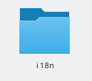{ #fig:001 width=15% }

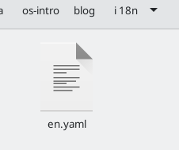{ #fig:002 width=15% }

## Создание папок ru и en

2. Создаю в /blog/content 2 папки: en и ru. И копирую все файлы, которые содержались в content в эти папки (рис. [-@fig:003]).

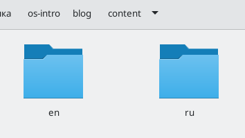{ #fig:003 width=55% }

## Добавление menus

3. В /blog/config/_default изменяю файл languages.yaml и добавляю 2 файла menus (рис. [-@fig:004] , [-@fig:005]))

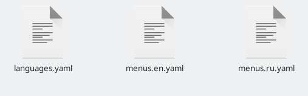{ #fig:004 width=55% }

## Изменение файла languages.yaml

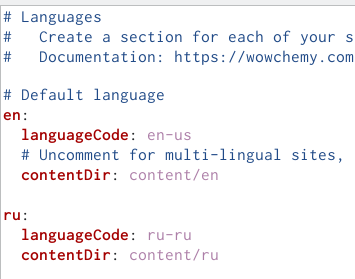{ #fig:005 width=55% }

## Поддержка английского и русского языков

4. Размещаю элементы сайта на обоих языках (рис. [-@fig:006], [-@fig:007], [-@fig:092] , [-@fig:091])

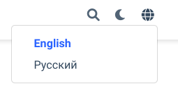{ #fig:006 width=55% }

## Размещение элементов сайта на обоих языках

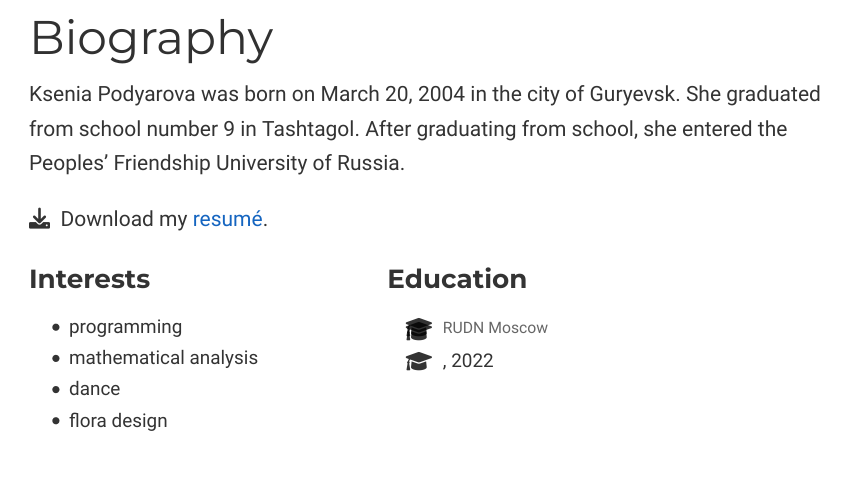{ #fig:007 width=65% }

## Размещение элементов сайта на обоих языках

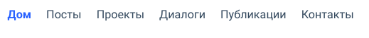{ #fig:092 width=55% }

## Размещение элементов сайта на обоих языках

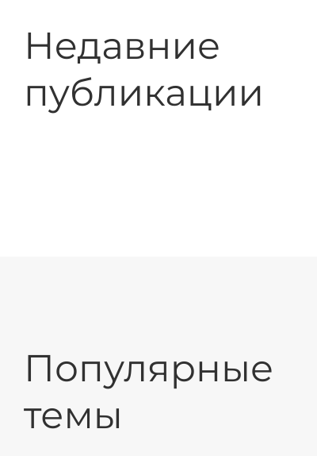{ #fig:091 width=35% }

## Размещение контента на обоих языках

5. Размещаю контент на обоих языках (рис. [-@fig:008], [-@fig:042], [-@fig:041])

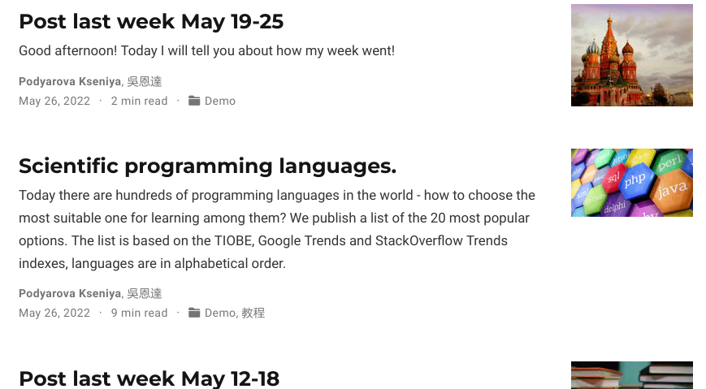{ #fig:008 width=50% }

## Размещение контента на обоих языках

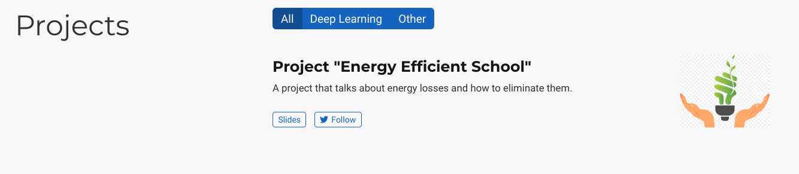{ #fig:042 width=65% }

## Размещение контента на обоих языках

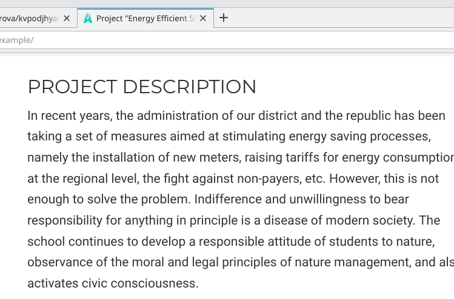{ #fig:041 width=55% }

## Создание 2-х постов

6. Добавляю 2 поста: пост по прошедшей неделе и пост на тему "День защиты детей". Для этого в папке post создаю 2 новые папки и изменяю файл index.md (рис. [-@fig:009],  [-@fig:011])

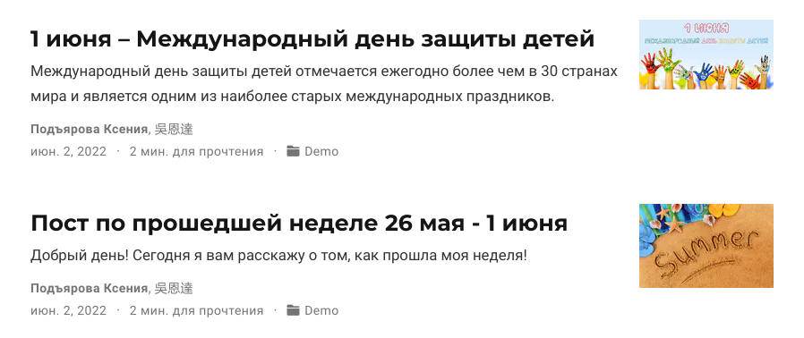{ #fig:009 width=35% }

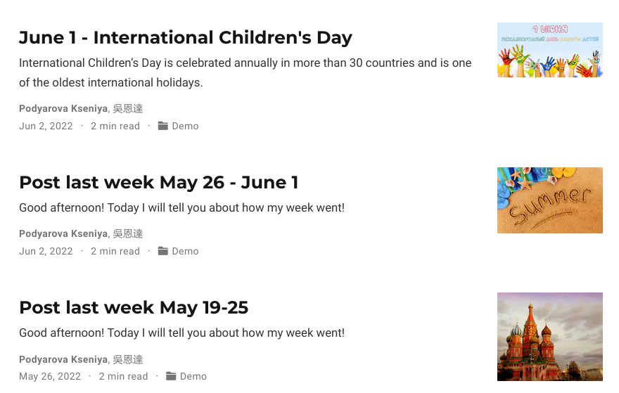{ #fig:011 width=35% }

# Выводы

Я научилась делать поддержку русского и английского языков

